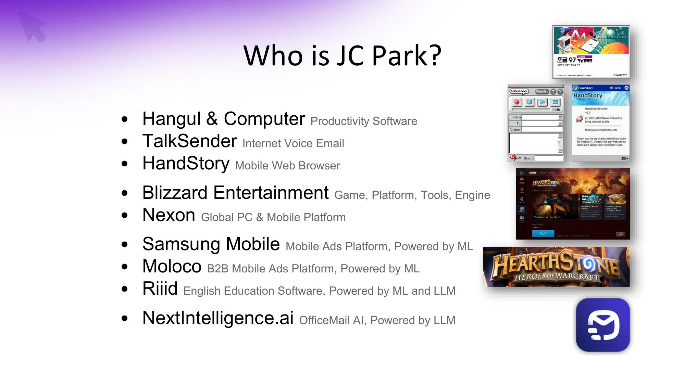

## Slide 1

---

**녹취록 요약:**
> 발표자는 30년 경력의 개발자로, 최근 7년간 AI 분야에 집중하며 AI 전도사 역할을 하고 있습니다. 인터넷과 모바일이 세상을 바꾼 것이 아니라 웹과 아이폰이 바꾼 것처럼, LLM의 등장이 AI 시대를 열었으며, 이를 통해 바이브 코딩이 가능해졌다고 설명합니다.

## Slide 2

---

**녹취록 요약:**
> LLM의 등장으로 AI 코딩이 가능해졌고, 이는 바이브 코딩 시대를 열었으며, 앞으로 1년 안에 코딩 외 다른 분야에서도 급격한 변화가 있을 것이라고 예측합니다.

## Slide 3

---

**녹취록 요약:**
> 바이브 코딩은 LLM을 활용하여 대화하듯이 코딩하는 것을 의미하며, LLM이 인터넷의 방대한 코딩 정보를 학습하고 프로그래밍 언어의 안정성 덕분에 코딩을 잘할 수밖에 없다고 설명합니다.

## Slide 4

---

**녹취록 요약:**
> LLM은 오토 컴플릿을 넘어 간단한 프로그램 작성 및 모듈 생성까지 가능하며, 이제는 동료 개발자 수준으로 발전하여 전체 프로젝트 컨텍스트를 이해하고 협력할 수 있다고 강조합니다. LLM의 장점은 엄청난 양의 컨텍스트를 빠르게 처리하는 능력입니다.

## Slide 5

---

**녹취록 요약:**
> Cursor, Claude Code, OpenAI Codex 등 다양한 AI 코딩 도구들이 활발히 개발되고 있으며, OpenAI의 분석에 따르면 API 호출을 통해 가장 많은 수익을 창출하는 분야가 코딩 관련 서비스라고 언급합니다.

## Slide 6

---

**녹취록 요약:**
> OpenAI가 코딩 어시스턴트 회사인 WithSorf를 인수한 사례를 들며, AI와 함께 코딩하는 것이 미래의 필수적인 요소임을 강조합니다. 또한, 1인 개발자가 바이브 코딩을 활용하여 6개월 만에 만든 웹사이트가 1천억 원에 인수된 사례를 통해 생산성 향상과 제품 중심의 개발 중요성을 설명합니다.

## Slide 7

---

**녹취록 요약:**
> AI 시대에 채용 및 교육 방식이 변화하고 있으며, 빅테크 기업들은 AI에 적응하지 못하는 인력을 정리하고 AI 활용 능력이 뛰어난 주니어 및 시니어 개발자를 선호한다고 설명합니다. 발표자는 AI 교육의 중요성을 강조하며, 바이브 코딩 교육을 통해 개발자들이 전문성을 갖춰야 한다고 말합니다.

## Slide 8

---

**녹취록 요약:**
> 발표자의 회사에서도 AI가 코드의 20%를 생성하고 있으며, 스타트업들은 AI를 활용하여 코드의 95%를 생성하는 등 아이디어 기반의 빠른 개발이 이루어지고 있다고 언급합니다. 빅테크 기업들은 이러한 변화에 적응하기 위해 노력하고 있지만, 한국의 대기업들은 변화에 더디다고 지적합니다.

## Slide 9

---

**녹취록 요약:**
> AI 시대에는 개발자들이 일을 쪼개고, 프론트엔지니어링과 시스템 오케스트레이션 역량을 키워야 하며, LLM의 한계를 이해하고 활용하는 것이 중요하다고 강조합니다. 또한, 코딩 외에도 요구사항 분석, 기획, 테스트, 제품 출시 등 모든 개발 과정에서 AI 활용 능력을 키워야 한다고 말합니다.

## Slide 10

---

**녹취록 요약:**
> AI 시대에는 도메인 전문가의 중요성이 더욱 커지며, 시니어 개발자들은 AI를 통해 정년 연장의 꿈을 이룰 수 있다고 언급합니다. 개발자들은 문제 정의, 오케스트레이션, 전문 분야 지식 등 총체적인 능력을 키워야 하며, 기술 변화에 끊임없이 학습하고 적응해야 한다고 강조합니다.

## Slide 11

---

**녹취록 요약:**
> LLM은 자연어 기반의 답변 시스템이며, RAG(검색 증강 생성)를 통해 웹 검색 결과까지 활용하여 답변을 제공합니다. 복잡한 문제 해결을 위해서는 LLM 에이전트가 필요하며, 여러 에이전트가 협력하는 에이전트 워크플로우가 중요하다고 설명합니다. 쇼피파이 사례를 통해 프로덕트 엔지니어와 같은 새로운 직무의 등장을 언급합니다.

## Slide 12

---

**녹취록 요약:**
> 쇼피파이 CEO의 메시지를 통해 AI가 모든 일의 기본이며, AI 활용 능력은 필수라고 강조합니다. 프로토타입 제작에 AI를 활용하고, 인사 평가에 AI 사용량을 반영하며, 회사 전체가 AI로 변신하기 위해 공유와 학습이 중요하다고 말합니다.

## Slide 13

---

**녹취록 요약:**
> 쇼피파이 CEO는 사람을 새로 뽑기 전에 AI로 모든 것을 시도해보고, 모든 임원들이 AI를 잘 활용해야 한다고 강조합니다. 이는 실무 역량이 없는 관리형 리더들이 도태될 수 있음을 시사하며, 한국의 대기업들도 이러한 변화에 주목해야 한다고 말합니다.

## Slide 14

---

**녹취록 요약:**
> 한국은 챗GPT 유료 사용자 2위, MAU 1천만 명 이상으로 AI 활용에 매우 적극적이며, 젊은 세대는 이미 AI에 익숙하다고 설명합니다. 시니어 개발자는 AI를 통해 재부흥의 기회를 얻고, 주니어 개발자는 AI 활용 능력을 키워야 한다고 강조합니다.

## Slide 15

---

**녹취록 요약:**
> 발표자는 변화하지 않으면 도태된다고 경고하며, 바이브 코딩과 같은 AI 활용 능력을 통해 일하는 방식을 근본적으로 바꿔야 생존할 수 있다고 강조합니다.

## Slide 16

---

**녹취록 요약:**
> (이 슬라이드에는 녹취록 내용이 없습니다.)

## Slide 17

---

**녹취록 요약:**
> (이 슬라이드에는 녹취록 내용이 없습니다.)