# Section 4: 프로덕션 개발을 위한 바이브코딩 (정도현)

## Slide 1
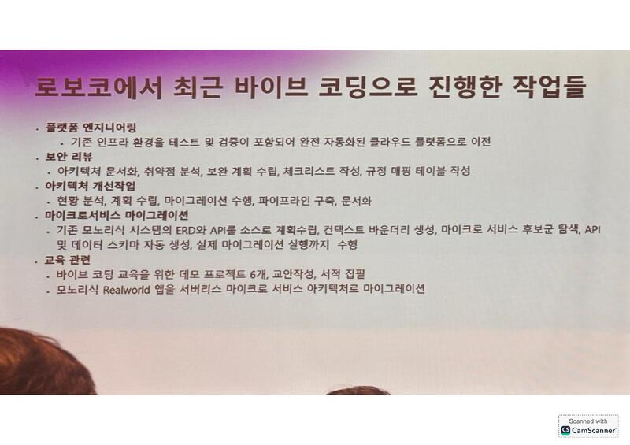

---

**녹취록 요약:**
> 강사 소개: 정도현 (포코 대표/컨설턴트)
> - 30년 개발 경력, AWS 출신 (소프트웨어 개발자 → 테크니컬 트레이너)
> - 2025년 2월 창업, 프로덕션 레벨 바이브 코딩 컨설팅 및 교육 전문
> - "바쁜 여러분 대신 공부해 드립니다" 캐치프레이즈로 실전 경험 기반 솔루션 제공

**주요 포인트:**
- 95년부터 SDS 유니텔에서 개발 시작
- 나눔 프로그래머 팟캐스트 10년 운영 (정개발 닉네임)
- 구글 출신 시니어 개발자와 함께 바이브 코딩 컨설팅 진행

## Slide 2

---

**녹취록 요약:**
> 로보코에서 최근 바이브 코딩으로 진행한 작업들:
> - 플랫폼 엔지니어링: 기존 인프라 환경 테스트 자동화 및 서버리스 클라우드 플랫폼 이전
> - 보안 리뷰: ISMS 심사 대비 아키텍처 문서화, 취약점 분석, 보안 계획 수립
> - 아키텍처 개선: 현황 분석부터 마이그레이션, 파이프라인 구축까지
> - 모노리식 → 마이크로서비스 마이그레이션: ER 다이어그램 리버스 엔지니어링 후 AI 활용

**주요 포인트:**
- 6개월 내 작업, 대부분 2주 안에 완료되는 압도적 생산성
- AI를 활용한 서비스 바운더리 탐색 및 API/데이터 스키마 자동 생성

## Slide 3
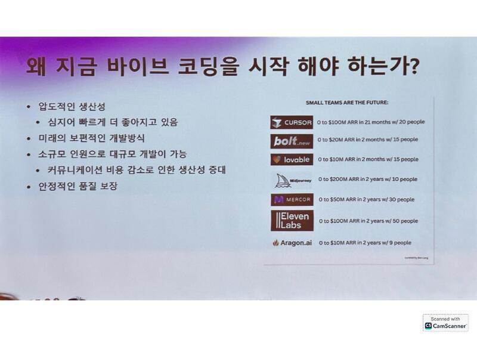

---

**녹취록 요약:**
> 교육 관련 작업:
> - 바이브 코딩 데모 프로젝트 10개 이상 개발
> - 교육 과정 작성, 책 집필, 교육 컨텐츠 제작
> - 한빛미디어에서 바이브 코딩 교육 런칭 (분기별 업데이트 제공)

**주요 포인트:**
- 최신 툴 사용 방식으로 지속적 업데이트
- 실무에서 바로 활용 가능한 실전 중심 교육

## Slide 4
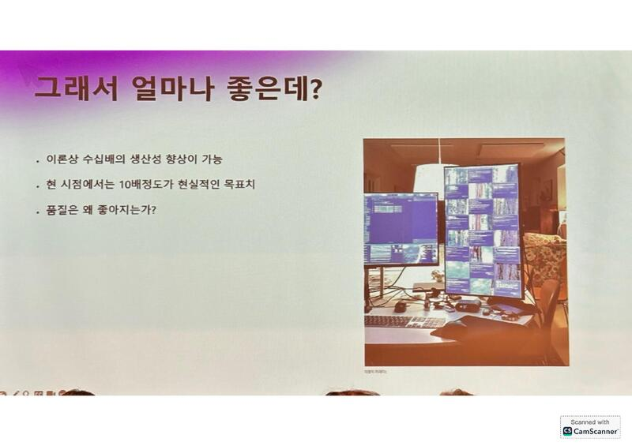

---

**녹취록 요약:**
> 바이브 코딩의 정의와 역사:
> - 원래 의미: 무계획적, 충동적 개발 (설계 없이 즉흥적으로 코딩)
> - 2025년 안드레 캠퍼(OpenAI 창업멤버, Tesla AI 디렉터)가 재정의
> - 자연어로 AI에게 코딩 지시하고 방향만 가이드하는 개발 방식
> - Anthropic의 "Agent Coding" 용어와 경쟁했으나 "Vibe Coding"이 대세로 자리잡음

**주요 포인트:**
- 기존 부정적 의미에서 혁신적 개발 방식으로 의미 전환
- 입에 붙기 쉬운 용어로 빠르게 확산

## Slide 5
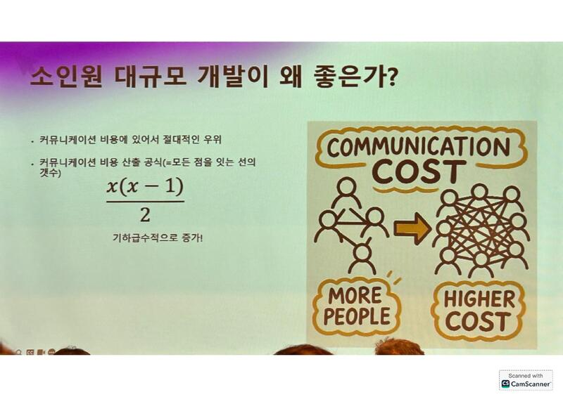

---

**녹취록 요약:**
> 바이브 코딩을 시작해야 하는 이유:
> - 압도적인 생산성 향상 (현재도 좋지만 계속 발전 중)
> - 멀지 않은 미래에 보편적 개발 방식으로 자리잡을 가능성
> - 소규모 인원으로 대규모 개발 가능
> - 커뮤니케이션 비용 절감 및 안정적 품질 보장

**주요 포인트:**
- 핵심 개발자 의존도 감소로 프로젝트 안정성 확보
- AI가 품질을 보증하는 시스템

## Slide 6

---

**녹취록 요약:**
> 바이브 코딩 성공 사례들:
> - 커서(Cursor), 볼트(Bolt), 러버블(Replit) 등 조 단위 기업가치 인정
> - 개발팀 10-20명으로 거대 기업들과 경쟁하여 승리
> - 구글, MS, Intel, Visual Studio 등 기존 강자들을 압도
> - 선점 효과가 아닌 압도적 생산성으로 시장 점유

**주요 포인트:**
- 이론상 수십 배, 현실적으로 10배 생산성 향상 가능
- 대기업과의 경쟁에서도 우위 확보 가능

## Slide 7
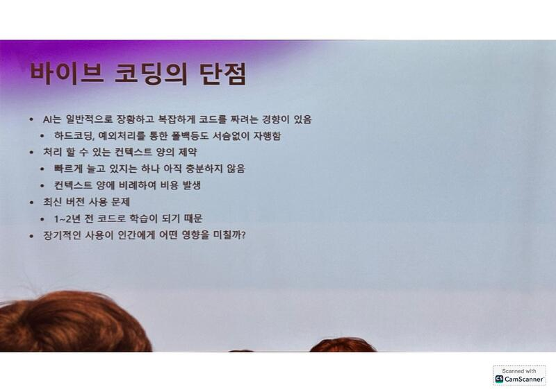

---

**녹취록 요약:**
> 커뮤니케이션 비용 분석:
> - 1명: 커뮤니케이션 비용 0
> - 2명: 1개 연결, 3명: 3개 연결, 4명: 6개 연결
> - 공식: n(n-1)/2 (기하급수적 증가)
> - 소인원 대규모 개발의 이점

**주요 포인트:**
- 바이브 코딩으로 소수 정예 팀 구성 시 커뮤니케이션 오버헤드 최소화
- 효율적 개발 프로세스 구축 가능

## Slide 8

---

**녹취록 요약:**
> 바이브 코딩 완성 시 미래 전망:
> - 사람 개입 없는 완전 자동 개발 시점에서 특이점 발생
> - 코드가 자산에서 부채로 전환
> - 기존 코드 모두 레거시화, 온디맨드 소프트웨어 생성 시대
> - 요구사항만 제시하면 최신 기술로 최적화된 소프트웨어 즉시 생성

**주요 포인트:**
- 개발자 역할 변화: 코딩 행위는 사라지지만 준비된 개발자는 생존
- 역사적으로 반복된 패턴 (어셈블리어 등장 시 폰 노이만의 반대와 유사)

## Slide 9

---

**녹취록 요약:**
> 바이브 코딩의 현재 단점들:
> - AI가 장황하고 복잡한 코드 생성 경향 (GitHub 등에서 학습한 습성)
> - 하드코딩이나 예외처리로 문제를 임시방편으로 해결하려는 성향
> - 처리 가능한 컨텍스트 양의 제한 (빠르게 개선 중이지만 비용 증가)
> - 최신 버전보다 1-2년 전 코드 패턴 선호

**주요 포인트:**
- AI의 무지성적 행동을 컨트롤할 수 있는 능력 필요
- 컨텍스트 양 증가에 따른 비용 관리 필요

## Slide 10

---

**녹취록 요약:**
> 뇌파 측정을 통한 바이브 코딩 효과 분석:
> - MW75 노이즈캔슬링 헤드폰($700, 뇌파센서 내장)으로 집중도 측정
> - 기존 코딩: 1시간 반 동안 99% 높은 집중력 유지 필요
> - 바이브 코딩: 기획/설계 단계에서만 높은 집중력, 이후 중-저 집중력으로도 진행 가능
> - 중간 집중력 상승 구간은 디버깅이나 방향성 재조정 시점

**주요 포인트:**
- CPU 여유 시 멀티 프로세싱처럼 여러 프로젝트 동시 진행 가능
- 4개 프로젝트 동시 진행해도 집중도 그래프 유사

## Slide 11
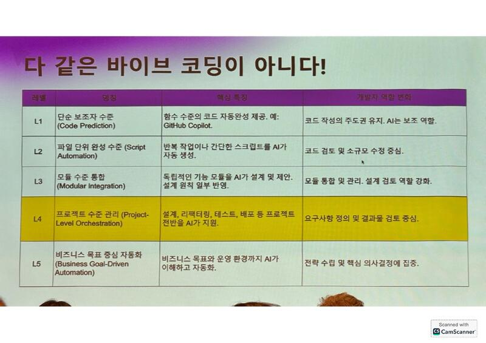

---

**녹취록 요약:**
> 바이브 코딩이 프로덕션에서 실패하는 이유 1 - 도구와 프로세스 문제:
> - 레벨링에 맞는 도구와 프로세스 미사용
> - 다양한 도구가 나오지만 적절한 활용 경험자 부족
> - SNS에서 "간단한 건 되는데 복잡해지면 버그만 만든다"는 불만 증가

**주요 포인트:**
- 제대로 된 방법 없이는 AI가 모든 것을 자동화해주지 않음
- 적절한 도구 선택과 활용법 학습 필요

## Slide 12
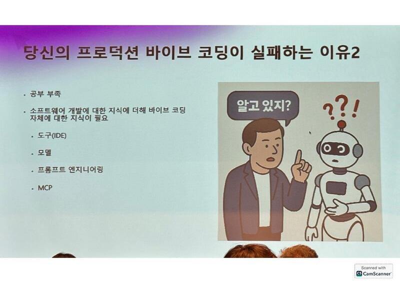

---

**녹취록 요약:**
> 바이브 코딩 생산성 공식:
> P = (X × Y) + Z
> - P: 총 생산성
> - X: 개발자 개인 생산성
> - Y: 툴과 프로세스 생산성  
> - Z: 순수 AI 생산성

**주요 포인트:**
- 개발자가 0이면 Z만으로는 폭발적 생산성 기대 어려움
- 개발자 역량과 적절한 툴/프로세스가 모두 갖춰져야 시너지 효과
- Z값은 제한적이지만 빠르게 성장 중

## Slide 13
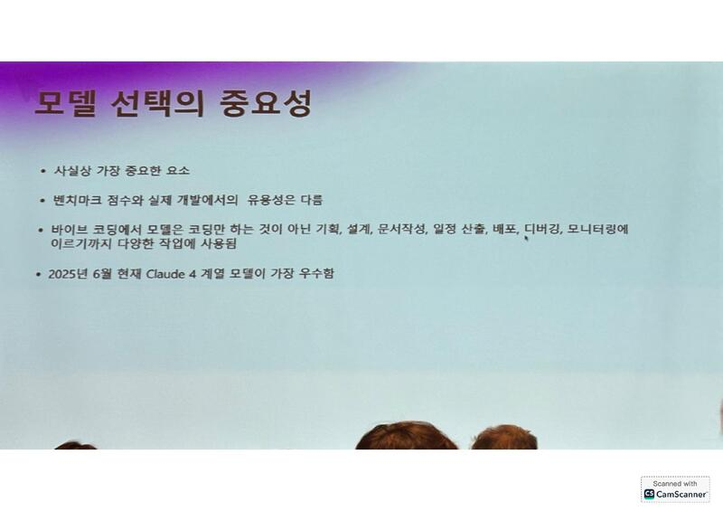

---

**녹취록 요약:**
> 바이브 코딩 척도 (Level 1-5):
> - Level 1: 코파일럿 수준의 함수 단위 자동완성
> - Level 2: 스크립트 하나 정도 AI 생성
> - Level 3-4: AI가 설계에도 관여
> - Level 4: 프로젝트 수준 관리 (설계, 리팩터링, 테스트, 배포, 프로젝트 관리)
> - Level 5: 비즈니스 요구사항만으로 완전 자동 개발 (미도달 영역)

**주요 포인트:**
- 오늘 강연의 포커스는 Level 4 (프로젝트 수준 관리)
- Level 5는 강인공지능 수준에서 가능할 것으로 예상

## Slide 14
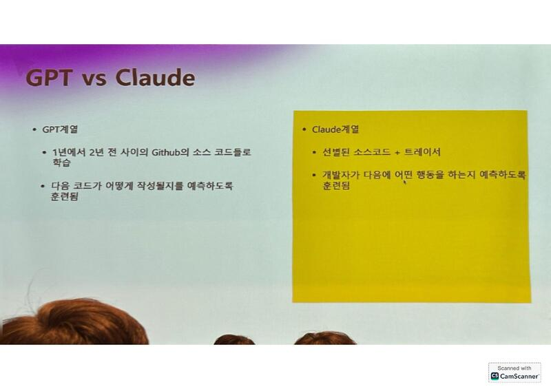

---

**녹취록 요약:**
> 바이브 코딩 실패 이유 2 - 공부 부족:
> - 소프트웨어 개발 지식 + 바이브 코딩 전용 지식 필요
> - 도구, 모델, 프롬프트 엔지니어링, MCP 등 다양한 툴링 이해 필요
> - 모델 선택이 바이브 코딩 성패를 좌우하는 가장 중요한 영역

**주요 포인트:**
- 벤치마크 점수와 실제 코딩 능력은 상관관계 낮음
- 코딩은 전체 개발 업무의 10-20%에 불과
- 개발 전 공정 이해 능력이 더 중요

## Slide 15
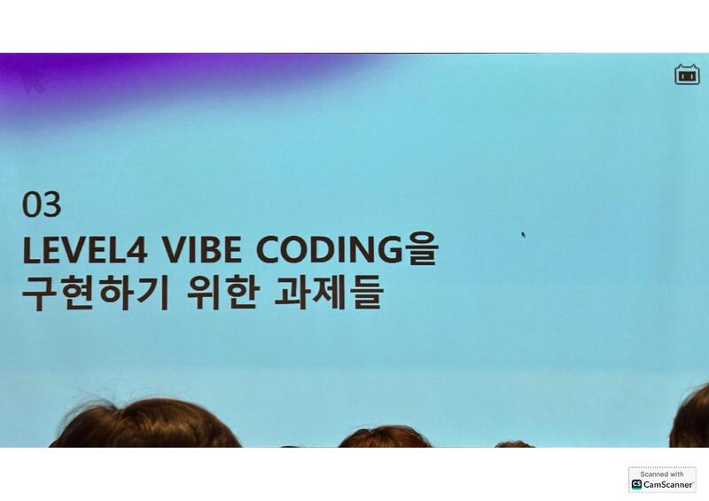

---

**녹취록 요약:**
> 현재 주요 모델 비교:
> - Claude 4 계열: 개발 관련 전체 공정에 대한 이해도 최고
> - GPT 계열: 1-2년 전 GitHub 코드로 학습, 다음 코드 예측에 특화, 규칙 준수 노력
> - Gemini: 외부 공개 모델은 성능 부족 (구글 내부용과 다른 것으로 추정)

**주요 포인트:**
- Claude는 개발자 행동 패턴 예측에 특화 (Anthropic 개발자 관찰 데이터 활용)
- CLI 도구, MCP 등 개발 도구 사용에 능숙

## Slide 16
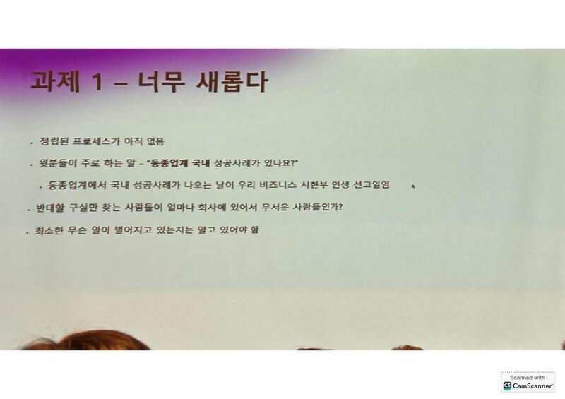

---

**녹취록 요약:**
> Level 4 프로젝트 관리 수준 구현 과제들:
> - 새로운 분야 (6개월 역사)로 축적된 프로세스 부족
> - 참고할 국내 성공 사례 부족 → "동종업계 국내 성공사례 보는 순간 비즈니스 끝"
> - 해외는 많은 성공사례 (구글 등 빅테크 모두 도입)
> - 회사 내 반대 세력: 새로운 기술에 대한 무지와 거부감

**주요 포인트:**
- 현 시점에서 바깥 세상 동향 파악의 중요성
- 변화에 저항하는 조직 문화의 위험성

## Slide 17
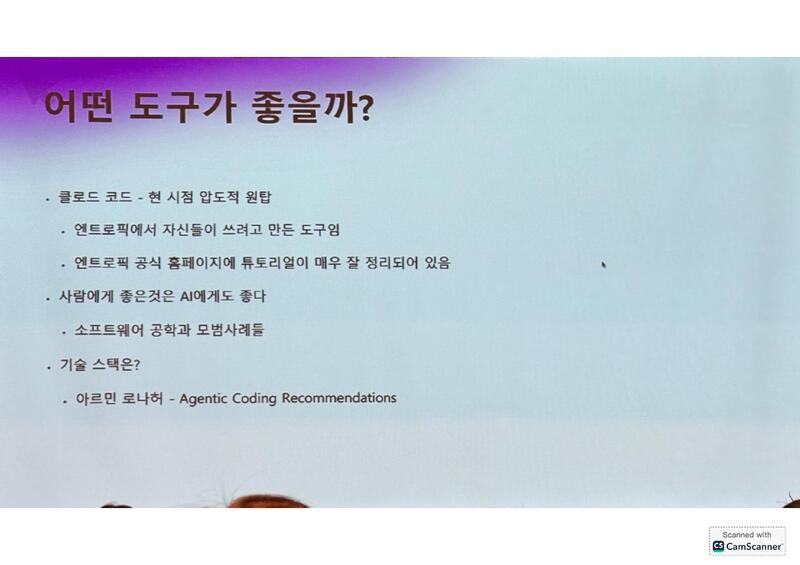

---

**녹취록 요약:**
> 현재 최고의 바이브 코딩 도구 - Claude Code:
> - Armin Ronacher(FastAPI 창시자)가 추천하는 원탑 도구
> - Cursor, Replit Surfboard보다 훨씬 우수한 성능
> - 블로그부터 댓글, 태깅 기능까지 포함된 Real World 애플리케이션을 처음부터 끝까지 사람 개입 없이 완성 가능

**주요 포인트:**
- Anthropic이 자사 엔지니어들을 위해 제작한 CLI 도구
- 모든 IDE에서 사용 가능하도록 CLI 기반으로 설계
- 공식 문서가 교과서 수준으로 잘 정리됨

## Slide 18

---

**녹취록 요약:**
> Claude Code의 주요 기능들:
> - 규칙 자동 생성 및 커맨드 기능
> - 워크플로우: 복잡한 작업들을 순차적으로 배치 처리
> - Headless 모드: 백그라운드에서 여러 인스턴스 실행
> - 부모 Claude Code가 자식들에게 독립적 작업 발주 가능
> - Planning Board: 코드 작성 전 계획 수립 기능

**주요 포인트:**
- 병렬 처리를 통한 개발 효율성 극대화
- 체계적인 계획 수립 후 구현 진행

## Slide 19
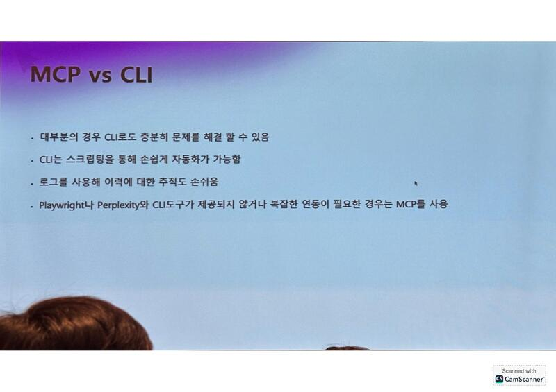

---

**녹취록 요약:**
> MCP vs CLI 선택 기준:
> - CLI 우선 고려: 스크립트 자동화 용이, 로그 관리 가능, 관찰성 우수
> - MCP가 필요한 경우: 프론트엔드 개발의 브라우저 조작, Perplexity MCP 등
> - Perplexity MCP 활용: 아키텍처 제안, 디버깅 지원 등에서 유용

**주요 포인트:**
- MCP는 알 수 없게 동작하는 경우 있어 CLI가 더 안정적
- 상황에 맞는 도구 선택이 중요

## Slide 20
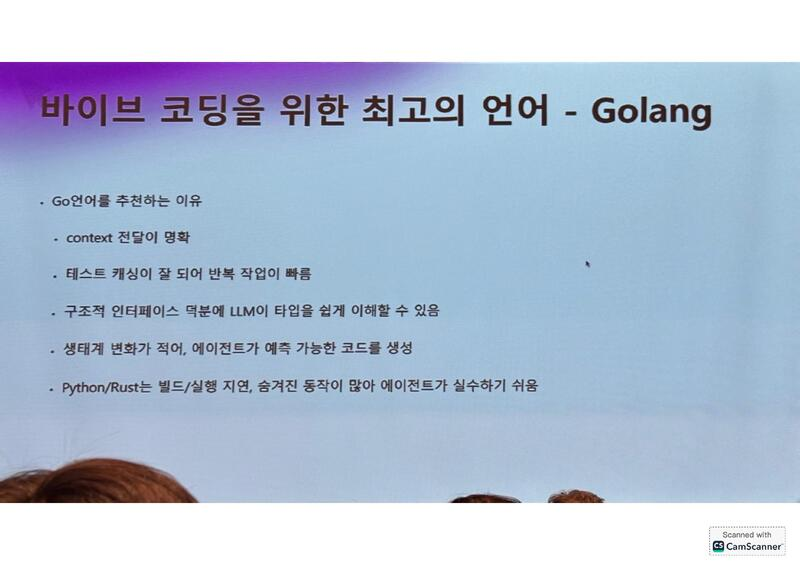

---

**녹취록 요약:**
> 바이브 코딩 최적 언어 - Go:
> - Armin Ronacher 추천 언어
> - 컨텍스트 전달이 명확하고 심플한 언어 구조
> - 테스트 캐싱 우수, 반복 테스트 시 빠른 속도
> - 구조적 인터페이스로 LLM이 타입 추론 용이
> - 생태계 변화가 적어 LLM 혼동 가능성 낮음

**주요 포인트:**
- JavaScript/TypeScript는 문법 변화가 많아 LLM이 혼동하기 쉬움
- 안정적이고 예측 가능한 코드 생성에 유리

## Slide 21
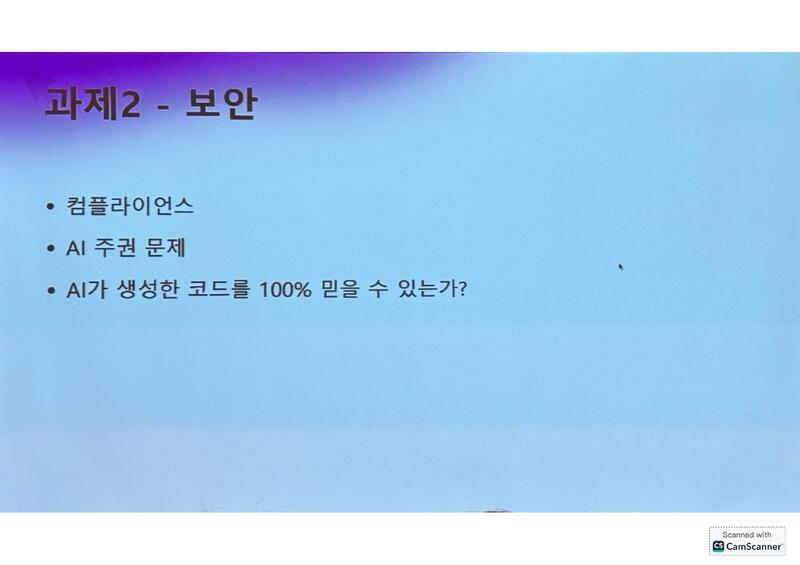

---

**녹취록 요약:**
> 프로덕션 레벨 보안 고려사항:
> - 컴플라이언스: AWS Bedrock을 통한 Claude API 활용 권장
> - AI 주권 문제: 트럼프의 적대적 AI 금지법, 미국 서버의 로그 수집 위험
> - 모든 국가에서 일정 수준의 AI 모델 확보는 선택이 아닌 필수 (인터스텔라 "Necessary" 장면 인용)

**주요 포인트:**
- 국내 컴플라이언스 충족을 위한 클라우드 서비스 활용
- 국가 차원의 AI 자주권 확보 필요성

## Slide 22
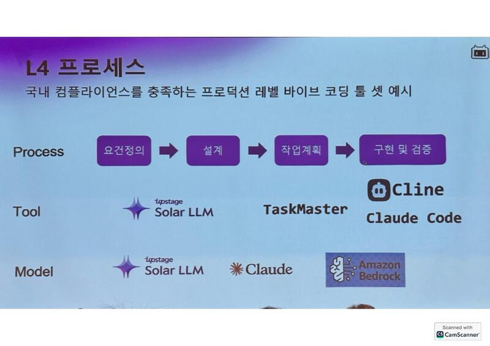

---

**녹취록 요약:**
> AI 생성 코드에 대한 신뢰성 문제:
> - 라이어 게임 명언 패러디: "코드를 의심하고 봐야 된다"
> - "테스트를 작성하지 않는 것은 코드를 알려는 노력의 포기, 믿는 게 아니라 무관심"
> - AI 생성 코드 100% 믿으면 안 됨 → 100% 의심하는 방법으로 개발 필요

**주요 포인트:**
- TDD(Test Driven Development)가 바이브 코딩에서 핵심
- AI가 TDD로 개발하도록 지시하면 자동으로 고품질 코드 생성
- 전통적 개발에서 TDD 도입 장벽이 바이브 코딩에서는 사라짐

## Slide 23

---

**녹취록 요약:**
> 바이브 코딩에서 일관성 문제 해결법:
> - AI의 방만한 코딩 욕구 억제 필요
> - 문서화, 규칙 자동 업데이트 시스템 구축
> - 코드/문서 예시, 템플릿, 샘플 제공으로 일관성 확보
> - 자동화된 코드 리뷰에서 기존 코드와의 일관성 강조
> - 깨진 창문 이론: 처음 코드의 틀을 잘 잡는 것이 중요

**주요 포인트:**
- AI는 기존 코드 패턴을 참고하므로 초기 코드 품질이 전체 프로젝트 품질 결정
- 시스템 프롬프트 활용한 일관성 유지

## Slide 24

---

**녹취록 요약:**
> 모델 컨텍스트 제한사항 해결:
> - 적절한 컨텍스트 크기 유지 필요
> - 마이크로서비스 아키텍처와 바이브 코딩의 궁합 우수
> - 모델 컨텍스트 증가로 미니 모노리식(수십개 테이블) 수준까지 커버 가능
> - 모노리식에서도 컨텍스트 제한 극복 테크닉 존재

**주요 포인트:**
- 문서화 자동화로 부족한 기억 용량 보완
- 작은 단위로 나눠서 구현과 검증을 빠르게 반복하는 것이 핵심

## Slide 25
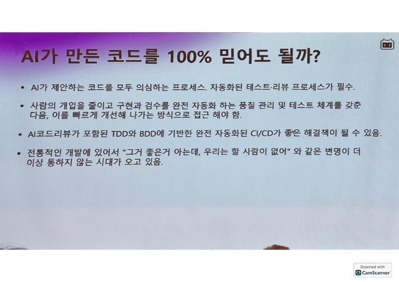

---

**녹취록 요약:**
> 실무를 위한 바이브 코딩 조언:
> - 요구사항과 함께 의도 전달: "왜 이 작업을 시키는지" 목적 명시
> - AI에게 먼저 질문: "이 작업을 하려면 내가 뭘 알려줘야 돼?"
> - 정기적 벤치마크: 새 모델/툴 나올 때마다 RealWorld 앱으로 성능 테스트
> - URL만 제공해도 AI가 동일한 앱 구현 가능한지 확인

**주요 포인트:**
- XY Problem 방지: 해결책 대신 문제의 근본 원인 전달
- 지속적인 도구 성능 평가 및 업데이트

## Slide 26
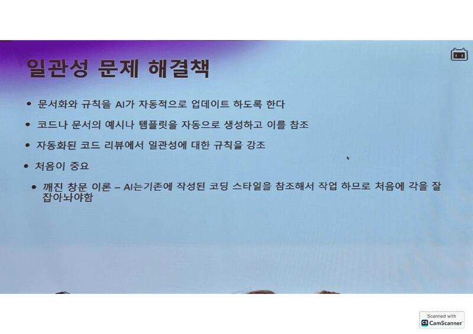

---

**녹취록 요약:**
> 바이브 코딩에서도 유효한 일반적 모범 사례:
> - 사람에게 유용한 것은 AI에게도 유용
> - 소프트웨어 공학의 여러 원칙들이 그대로 적용
> - 정적 코드 체커, 린트, 타입 체커, 테스트 등을 CICD 파이프라인에서 자동화
> - 캐시 적용으로 빠르고 저렴한 품질 검증

**주요 포인트:**
- 기존 소프트웨어 개발 베스트 프랙티스가 바이브 코딩에서도 중요
- 자동화된 품질 관리 시스템 구축 필수

## Slide 27
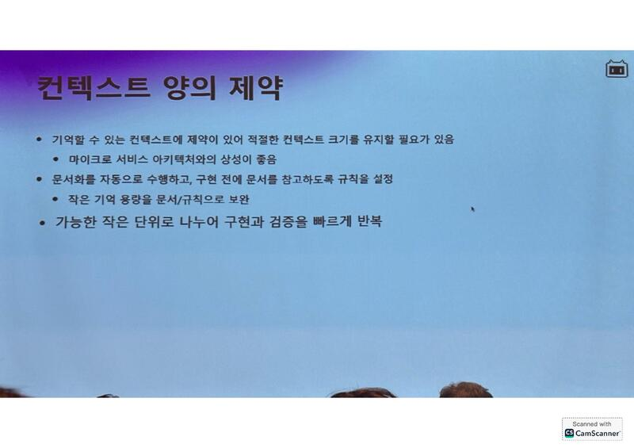

---

**녹취록 요약:**
> XY Problem과 올바른 문제 전달:
> - 원하는 것(X)과 다른 것(Y)을 요청하는 문제
> - 예시: DB 커넥션 풀 부족 → 단순히 "커넥션 늘려줘" 대신 "커넥션 구조 개선 방법" 문의
> - 큐잉, 쿼리 배치 처리 등 근본적 해결책 유도
> - 단순 인스턴스 크기 증가는 비용만 증가시키는 임시방편

**주요 포인트:**
- AI에게 해결책보다 문제의 본질과 의도를 전달하는 것이 중요
- 근본 원인 분석을 통한 효율적 해결책 도출

## Slide 28
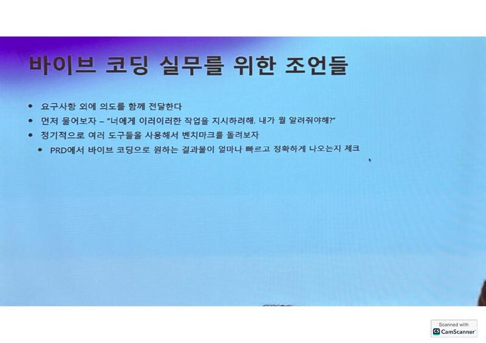

---

**녹취록 요약:**
> 아키텍처 설계 원칙들:
> - 마이크로서비스와 바이브 코딩의 궁합
> - SOLID 원칙: 수정에는 닫히고 확장에는 열린 구조
> - 작은 모듈들의 조합으로 복잡한 동작 구현
> - 결합도는 낮고 응집도는 높은 코드 작성
> - 클린 아키텍처: 코어 비즈니스 로직 격리

**주요 포인트:**
- DDD보다는 클린 아키텍처가 현 시점에서 더 실용적
- 단위 테스트, E2E 테스트, UI 테스트 자동 생성
- TDD 방식으로 자연스럽게 테스트 커버리지 확보

## Slide 29
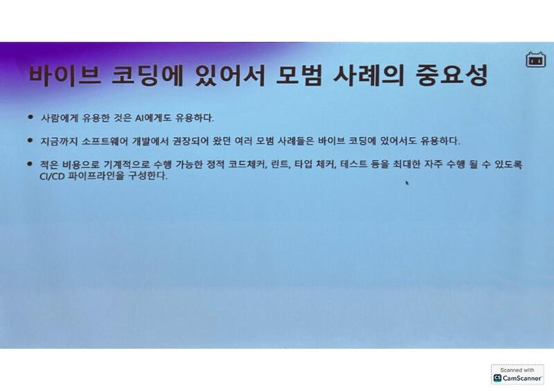

---

**녹취록 요약:**
> 개발 환경 설정 및 관리:
> - 버전 관리는 기본, 린터와 포매터 적극 활용
> - AI가 읽을 것이라고 린터/포매터 생략하면 안 됨
> - README 문서 상시 유지 및 업데이트 (AI가 수시로 참고)
> - 현재 진행 상황을 지라, 이슈 트래커로 관리하여 AI가 파악하도록 함

**주요 포인트:**
- AI 작업 환경에서도 코드 일관성과 문서화가 매우 중요
- 프로젝트 상태 추적을 통한 체계적 개발 관리

## Slide 30
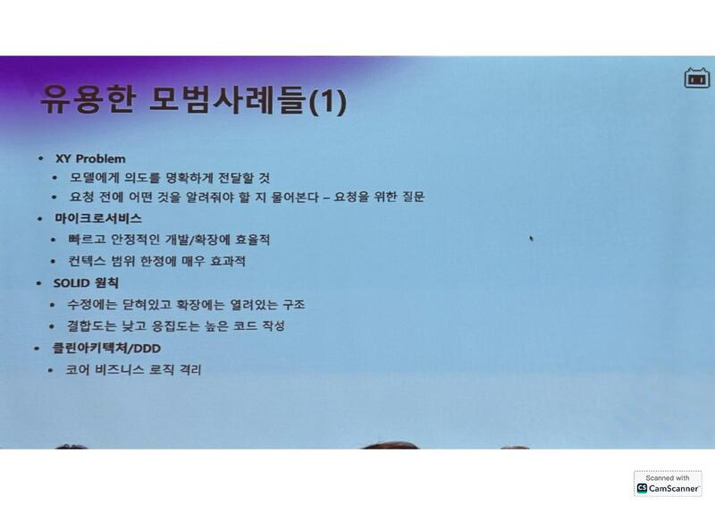

---

**녹취록 요약:**
> 바이브 코딩 최신 정보 소스:
> - Armin Ronacher 블로그 및 유튜브 채널 (FastAPI 창시자)
> - 바이브 코딩 뉴스 단톡방 운영
> - 단톡방 규칙: 바이브 코딩 관련 뉴스만 공유, 인사 불필요
> - 자신의 바이브 코딩 프로젝트 자랑 가능

**주요 포인트:**
- 빠르게 변화하는 분야이므로 지속적인 정보 업데이트 필요
- 커뮤니티를 통한 정보 공유와 학습

## Slide 31
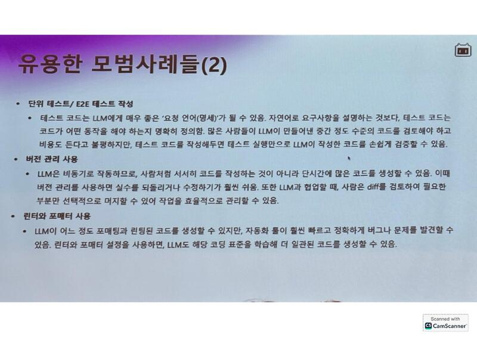

---

**녹취록 요약:**
> 질의응답 1 - Claude 4.0 vs Opus 비교:
> - Opus가 좀 더 똑똑하지만 복잡한 설계나 디버깅에서만 차이
> - 95% 작업은 Sonnet으로도 충분
> - 기본은 Sonnet 사용, 안 될 때만 Opus 활용하는 방식 추천

**주요 포인트:**
- 비용 효율성을 고려한 모델 선택 전략
- 작업 복잡도에 따른 적절한 모델 사용

## Slide 32
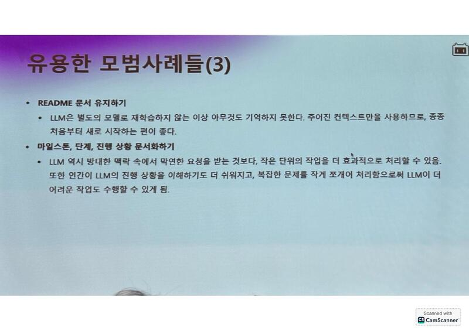

---

**녹취록 요약:**
> 질의응답 2 - BDD와 TDD 활용:
> - DDD는 TDD보다 상위 개념으로 필요시 사용
> - 단위 테스트는 반드시 필요, BDD/통합테스트/E2E 테스트도 적극 활용
> - 너무 많으면 시간 소모되므로 프로젝트 성격에 따른 적절한 균형점 찾기

**주요 포인트:**
- 테스트 전략의 다층화 및 프로젝트별 최적화

## Slide 33
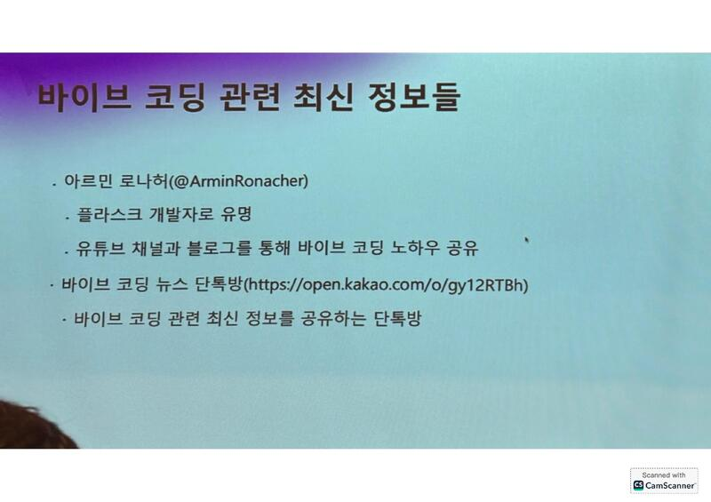

---

**녹취록 요약:**
> 질의응답 3 - 병렬 처리와 오케스트레이션:
> - AI에게 태스크 분할 및 의존성 파악 요청
> - 의존성 없는 작업들은 병렬 처리 가능 (예: 백엔드/프론트엔드)
> - 부모 Claude Code가 자식들에게 독립 작업 분산
> - 미래에는 프로젝트 현황을 시각적으로 보여주는 도구 등장 예상

**주요 포인트:**
- 작업 분할과 병렬 처리를 통한 개발 효율성 극대화
- AI의 태스크 관리 능력 활용

## Slide 34
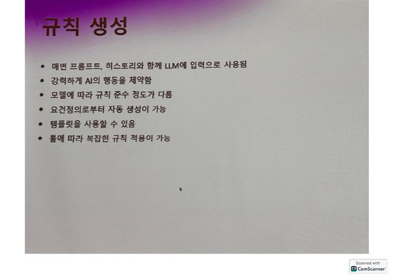

---

**녹취록 요약:**
> 질의응답 4 - 보수적 조직에서의 도입:
> - "안 되는 이유 찾기"보다 "어떻게 하면 쓸 수 있을지" 방법 찾기
> - 금융권도 토스, 카카오뱅크 등 신생 회사들이 기존 업체 압도
> - 변화 거부 세력의 위험성 인식 필요
> - 컴플라이언스 문제는 해결 방법을 찾아야 할 과제

**주요 포인트:**
- 조직 변화 관리의 중요성
- 경쟁력 확보를 위한 불가피한 선택

## Slide 35
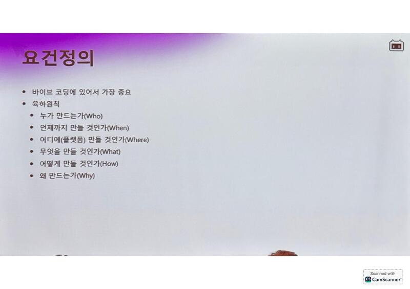

---

**녹취록 요약:**
> 질의응답 5 - Gemini CLI 평가:
> - 구글이 내부에서 사용하던 도구를 외부 공개한 것
> - 평판은 좋지만 아직 충분한 평가 시간 부족
> - 이전 Gemini 경험이 실망스러워서 신중한 접근
> - 개인적으로 구글/아마존 제품에 대한 불신 (개인 경험 기반)

**주요 포인트:**
- 새로운 도구에 대한 신중한 평가 필요
- 개인 경험을 바탕으로 한 도구 선택

## Slide 36

---

**녹취록 요약:**
> 라이브 데모 시작:
> - 빈 프로젝트에서 백엔드와 프론트엔드를 갖춘 투두 리스트 앱 개발
> - MVP(Minimum Viable Product) 방식으로 진행
> - 학습용 목적이므로 보안보다는 빠른 동작에 집중
> - PRD(Product Requirements Document) 작성부터 시작

**주요 포인트:**
- 실제 개발 프로세스의 체계적 접근
- 문서화 우선 개발 방식

## Slide 37

---

**녹취록 요약:**
> 데모 - PRD 작성 및 기술 스택 선정:
> - Claude Code로 PRD 문서 자동 생성
> - Armin Ronacher 추천 기술 스택 적용 (Go, React 등)
> - AI가 스스로 작업 계획 수립 (기술 스택 조사, 분석, 선정, 문서화)
> - 현재 토큰 소비량 실시간 확인 가능

**주요 포인트:**
- AI의 자율적 작업 계획 수립 능력
- 체계적인 문서 기반 개발 프로세스

## Slide 38

---

**녹취록 요약:**
> 데모 - Git 저장소 초기화 및 원격 저장소 연동:
> - Claude Code가 Git 초기화부터 GitHub 저장소 생성까지 자동 처리
> - CLI를 통한 원격 저장소 설정 및 푸시 자동화
> - 웹페이지 로그인, 리포지토리 생성, 리모트 설정을 모두 AI가 처리
> - 바이브 코딩 도구들의 빠른 발전과 서로 간의 기능 모방

**주요 포인트:**
- 인프라 설정의 완전 자동화
- AI 도구들의 급속한 발전과 표준화

## Slide 39

---

**녹취록 요약:**
> 데모 - 규칙 생성 및 구현 계획 수립:
> - 프로젝트 컨텍스트를 바탕으로 AI가 자동으로 규칙(claude.md) 생성
> - 영어로 작성된 행동 지침으로 향후 개발 과정에서 일관성 보장
> - 구현 계획(Implementation Plan) 문서 자동 생성
> - 일정 관련 내용은 제거하고 작업 순서와 구조에 집중

**주요 포인트:**
- 프로젝트 초기 설정의 중요성
- AI의 자율적 문서 생성 및 계획 수립 능력

---

## 전체 요약

이 강의는 **프로덕션 레벨에서 바이브 코딩을 도입하고 활용하는 방법**에 대한 포괄적인 가이드를 제공합니다.

### 핵심 메시지:
1. **바이브 코딩의 필연성**: 선택이 아닌 생존을 위한 필수 기술
2. **체계적 접근**: 단순한 코드 생성을 넘어 프로젝트 전체 관리 수준으로 발전
3. **도구와 프로세스**: Claude Code + 적절한 개발 방법론 조합이 핵심
4. **품질 보장**: TDD, 자동화된 테스트, 린터 등을 통한 코드 품질 관리
5. **조직 변화**: 기술적 도입을 넘어 조직 문화와 프로세스 혁신 필요

### 실무 적용 가이드:
- **Level 4 바이브 코딩**: 프로젝트 수준의 설계, 구현, 테스트, 배포 관리
- **최적 도구 조합**: Claude Code + Go 언어 + 마이크로서비스 아키텍처
- **개발 프로세스**: PRD → 규칙 생성 → 설계 → 태스크 분할 → TDD 구현 → 자동화된 CI/CD

이 강의는 바이브 코딩을 단순한 코딩 도우미가 아닌 **차세대 소프트웨어 개발 패러다임**으로 제시하며, 개발자와 조직이 이 변화에 어떻게 대응해야 하는지 구체적인 로드맵을 제공합니다.