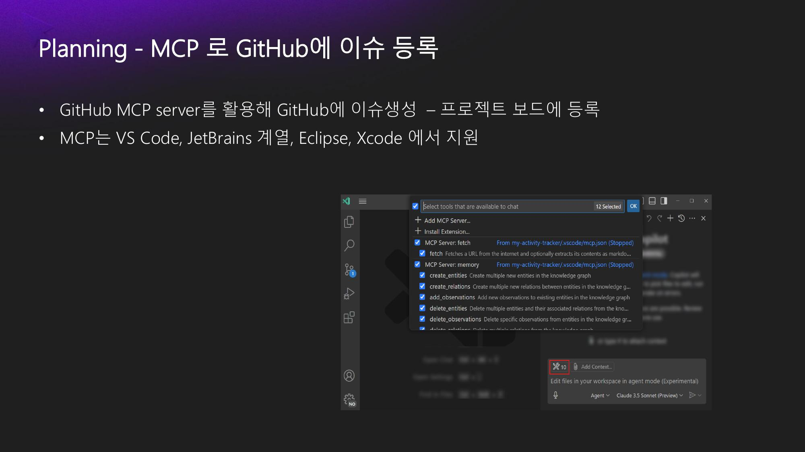
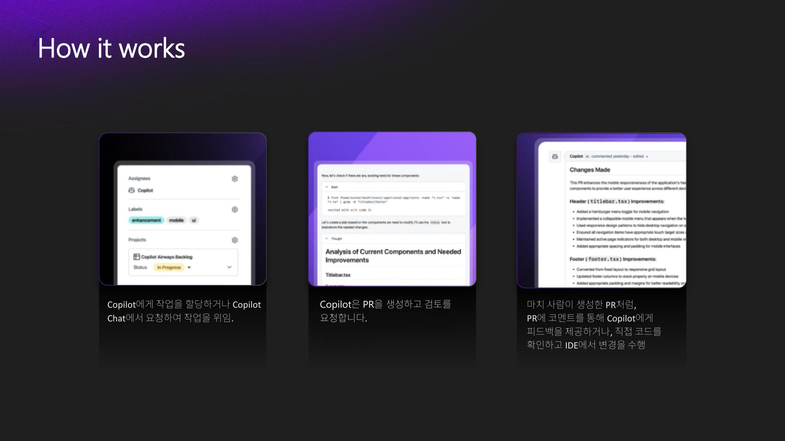

## Slide 1

---

**녹취록 요약:**
> 발표자는 GitHub Copilot이 단순한 개발 도구를 넘어 마이크로소프트와 GitHub의 많은 부분을 변화시키고 있으며, SDLC(소프트웨어 개발 주기) 전반에 AI 기능이 통합되고 있다고 설명합니다.

## Slide 2

---

**녹취록 요약:**
> GitHub Copilot은 보안 문제점을 자동으로 분석하고 해결 코드를 생성하여 Git 플랫폼에 적용하는 기능까지 발전했으며, 이는 요구사항 분석부터 플래닝, 이슈 등록까지 개발 전반을 지원하는 AI 도구들과 유사하다고 언급합니다.

## Slide 3

---

**녹취록 요약:**
> GitHub Copilot은 사용자가 원하는 코딩 스타일과 설계 문서를 참조하여 코드를 제안하며, AI 기반 코드 리뷰 기능도 제공합니다. 또한, 코딩 에이전트 모드를 통해 개발자가 직접 코딩하지 않고 AI에게 작업을 지시하고 다른 일을 할 수 있는 형태로 발전하고 있다고 설명합니다.

## Slide 4

---

**녹취록 요약:**
> GitHub Copilot에는 에이전트 모드, 에디트 모드, 에스크 모드 세 가지 모드가 있으며, 에이전트 모드는 AI가 스스로 반복하며 테스트를 완료할 때까지 작업을 수행합니다.

## Slide 5

---

**녹취록 요약:**
> 에스크 모드는 사용자 질문에 대해 Copilot이 코드를 제안하면 사용자가 이를 복사하여 적용하는 방식이며, 에디트 모드는 AI가 요청된 작업을 여러 파일에 자동으로 작성하지만 실행까지는 하지 않는다고 설명합니다.

## Slide 6

---

**녹취록 요약:**
> Copilot은 현재 열려 있는 파일의 커서 위치 주변 데이터와 열려 있는 다른 파일들을 참조하여 코드를 제안하며, 사용자가 주석으로 요청하거나 채팅창에 직접 질문하여 코드를 받을 수 있습니다.

## Slide 7

---

**녹취록 요약:**
> Copilot의 에이전트 모드는 AI가 스스로 반복하며 테스트를 완료할 때까지 작업을 수행하며, `#codebase` 툴을 통해 로컬 코드 베이스를 참조하여 관련된 파일을 찾고 수정하며, 테스트가 실패하면 스스로 분석하여 완료될 때까지 실행한다고 설명합니다.

## Slide 8

---

**녹취록 요약:**
> Copilot은 로컬 코드 베이스를 인덱싱하여 참조하며, AI가 테스트 코드를 만들고 실행하며, 실패 시 에러를 분석하여 완료될 때까지 반복합니다.

## Slide 9

---

**녹취록 요약:**
> Copilot의 챗 모드에는 에이전트 모드, 에디트 모드, 에스크 모드가 있으며, 이 세 가지 모드를 활용하여 코딩 작업을 할 수 있습니다. 이 기능들은 VS Code뿐만 아니라 JetBrains, Visual Studio, Eclipse, Xcode 등 다양한 IDE에 통합되어 있습니다.

## Slide 10

---

**녹취록 요약:**
> 발표자는 Copilot의 에이전트 모드와 에디트 모드를 설명하며, 에이전트 모드는 AI가 스스로 실행하고 완료할 때까지 분석하는 반면, 에디트 모드는 파일을 자동으로 쓰는 것까지만 한다고 강조합니다.

## Slide 11

---

**녹취록 요약:**
> 발표자는 특정 API를 사용하여 음악 순위를 표시하는 React 웹사이트를 만드는 시나리오를 제시하며, Copilot Instructions MD 파일을 통해 코딩 규칙, 요구사항 등을 미리 설정할 수 있다고 설명합니다.

## Slide 12

---

**녹취록 요약:**
> Copilot Instructions MD 파일은 `.github` 디렉토리 아래에 위치하며, 코딩 규칙, 요구사항, 디렉토리 구조, API 정보, 보안 점검 지침 등을 미리 설정하여 AI에게 제공할 수 있습니다.

## Slide 13

---

**녹취록 요약:**
> Copilot은 `.instruction.md` 파일을 통해 더 세부적인 지침을 받을 수 있으며, `applyTo` 키워드를 사용하여 특정 파일 확장자에만 적용되는 지침을 설정할 수 있습니다. 또한, 테스트 코드 작성 지침도 미리 설정하여 AI가 참조하도록 할 수 있습니다.

## Slide 14

---

**녹취록 요약:**
> Copilot의 커스텀 챗 모드를 통해 사용자가 원하는 모드를 직접 만들 수 있으며, `plan.md` 파일과 같이 계획만 작성하고 코드 수정은 하지 않는 모드를 설정하여 활용할 수 있습니다.

## Slide 15

---

**녹취록 요약:**
> 발표자는 Copilot이 구현 단계를 자동으로 생성하고, GitHub 리모트 저장소와 연동하여 프로젝트를 관리할 수 있음을 보여줍니다.

## Slide 16

---

**녹취록 요약:**
> Copilot은 GitHub 저장소의 이슈와 프로젝트에 자동으로 등록되며, 워크플로우를 통해 이슈나 풀 리퀘스트가 생성되면 자동으로 투두 리스트에 등록되도록 설정할 수 있습니다.

## Slide 17

---

**녹취록 요약:**
> Copilot의 에이전트 모드를 통해 GitHub MCP 서버를 등록하고, 프롬프트를 통해 이슈를 생성하고 코멘트를 추가하는 등의 작업을 자동화할 수 있습니다.

## Slide 18

---

**녹취록 요약:**
> Copilot은 이슈를 자동으로 생성하고, 사용자가 컨티뉴 버튼을 누르면 실행하며, 이슈를 잘 만드는 것도 중요하다고 언급합니다. MCP 서버 등록은 VS Code에서 간단하게 할 수 있습니다.

## Slide 19

---

**녹취록 요약:**
> 사용자는 직접 MCP 서버를 만들거나 기존 서버를 등록하여 Copilot과 연동할 수 있으며, 이를 통해 다양한 기능을 활용할 수 있습니다.

## Slide 20

---

**녹취록 요약:**
> Copilot은 1단계 프로젝트를 진행하고, 요청에 따라 Git 푸시로 리모트 저장소를 업데이트하며, GitHub 저장소의 이슈를 자동으로 닫는 등의 작업을 수행합니다.

## Slide 21

---

**녹취록 요약:**
> Copilot은 Git 푸시 외에도 별도의 Git 브랜치로 체크아웃하고 변경 사항을 커밋한 후 풀 리퀘스트를 생성하는 등 다양한 Git 워크플로우를 지원합니다.

## Slide 22

---

**녹취록 요약:**
> Copilot은 Git 워크플로우를 자동화하여 체크아웃부터 개발, 풀 리퀘스트 생성까지의 과정을 지원하며, 실제 개발 단계의 전 과정을 자동화할 수 있습니다.

## Slide 23

---

**녹취록 요약:**
> Copilot은 트러블 슈팅 기능도 제공하며, 사용자가 스크린샷이나 네트워크 데이터를 제공하면 에러를 분석하고 해결 방법을 제시합니다.

## Slide 24

---

**녹취록 요약:**
> Copilot은 스크린샷을 통해 에러를 분석하고 해결 방법을 제시하며, 에이전트 모드에서는 실제 실행까지 수행합니다. 또한, VS Code 내에서 로컬 웹사이트를 띄우고, 챗에 요소를 추가하는 기능도 제공합니다.

## Slide 25

---

**녹취록 요약:**
> 발표자는 Copilot의 코드 완성 기능, 에디트 모드, 에이전트 모드를 설명하며, 에이전트 모드는 GitHub.com 저장소에서 개인용 라이선스로도 실행 가능하다고 언급합니다.

## Slide 26

---

**녹취록 요약:**
> Copilot은 GitHub 이슈에 어사인되면 자동으로 브랜치를 생성하고 개발을 진행하며, 작업 진행 상황을 표시하고 코드 리뷰까지 자동으로 수행합니다.

## Slide 27

---

**녹취록 요약:**
> Copilot은 GitHub 저장소의 룰을 통해 코드 리뷰를 자동으로 수행하도록 설정할 수 있으며, 개인 레벨에서도 VS Code에서 동일한 설정을 할 수 있습니다. 또한, 코딩 에이전트에게 맡길 수 있는 작업과 그렇지 않은 작업이 있다고 언급합니다.

## Slide 28

---

**녹취록 요약:**
> Copilot은 코드 테스트 커버리지 개선, 종속성 관리, 패턴 표준화, 에러 패턴 처리 등 다양한 작업을 코딩 에이전트에게 맡길 수 있으며, 자동으로 코드 리뷰를 받고 수정하는 과정을 통해 개발 효율성을 높일 수 있습니다.

## Slide 29

---

**녹취록 요약:**
> Copilot은 프롬프트 파일을 통해 공통된 개발 작업이나 보안 점검 규칙 등을 미리 정의하고 재활용할 수 있으며, 이를 통해 팀 내에서 일관된 개발 프로세스를 유지할 수 있습니다.