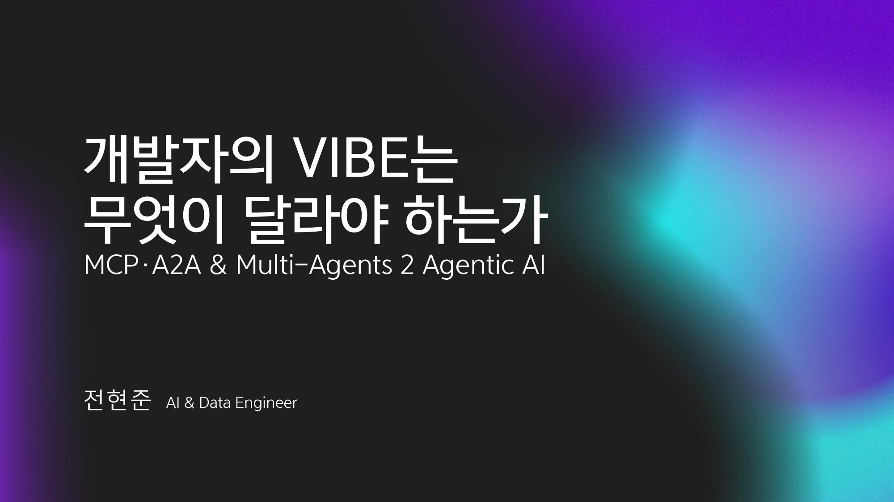
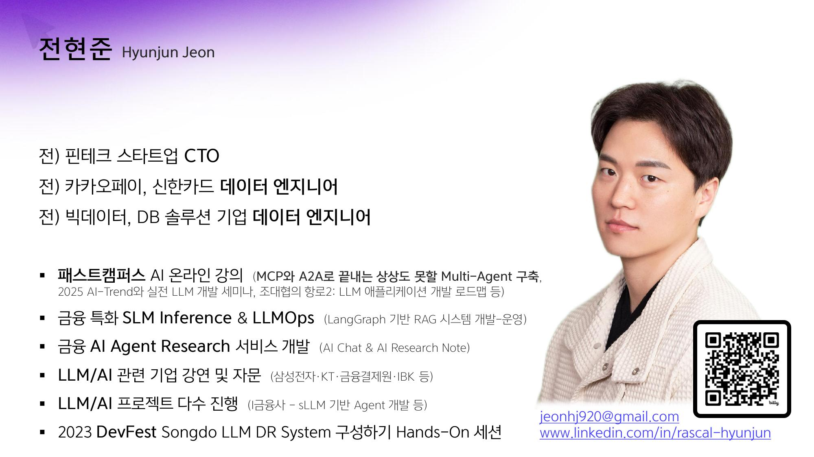
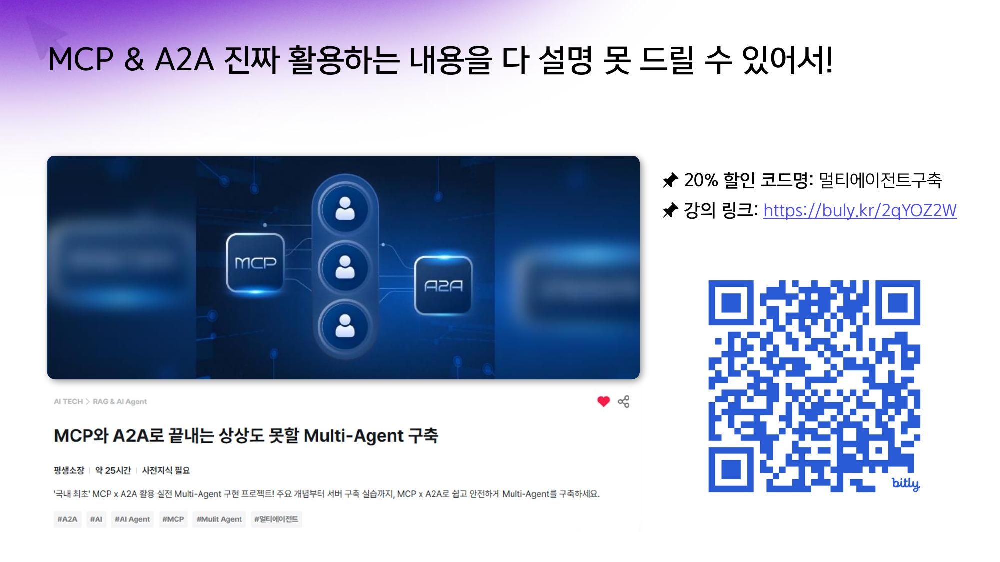
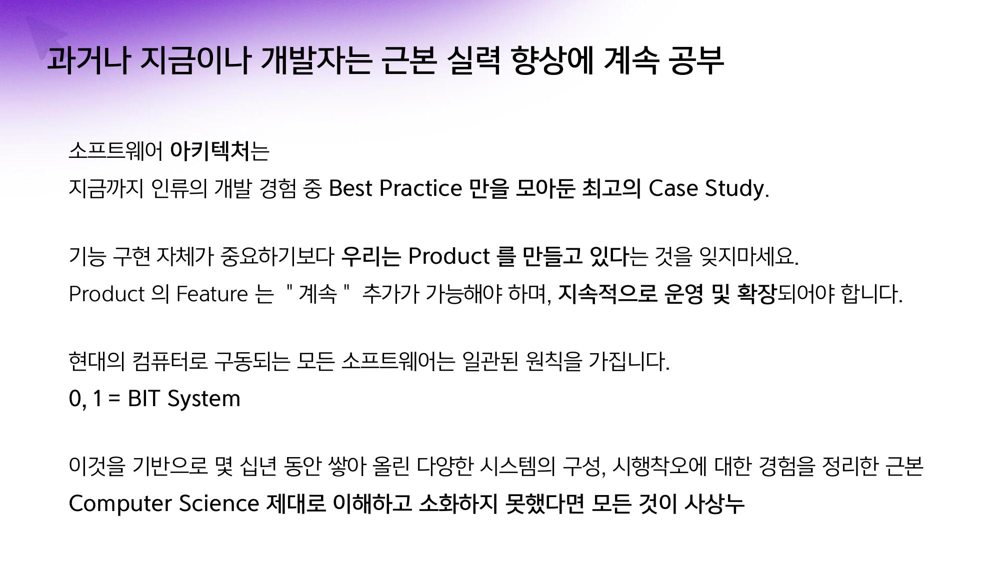
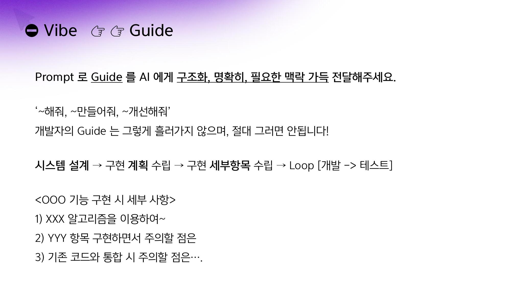
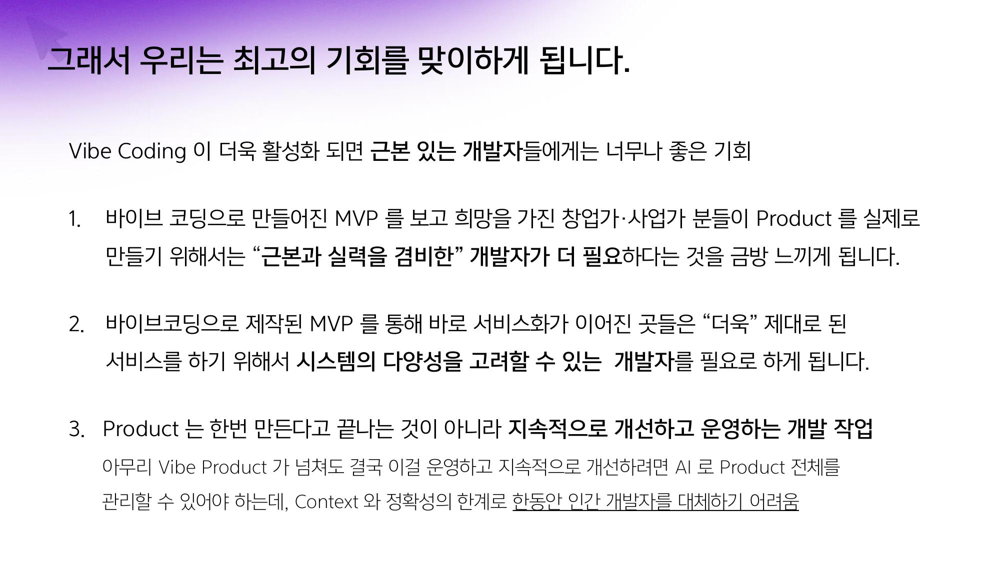
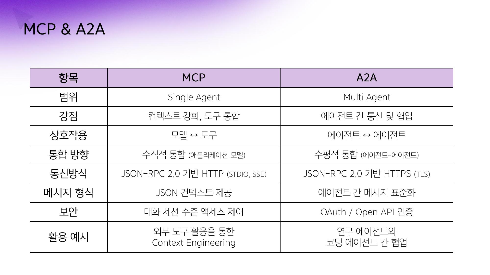
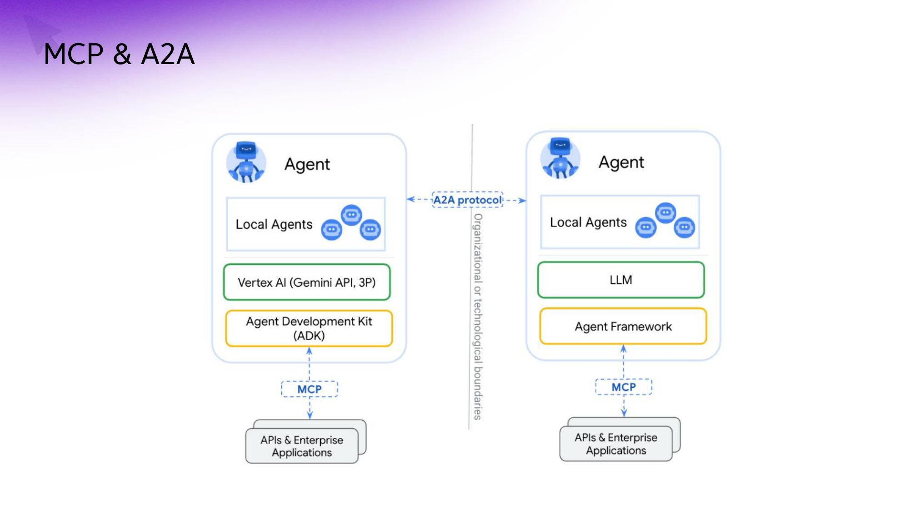
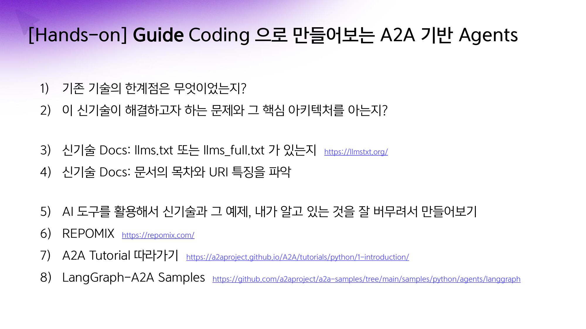
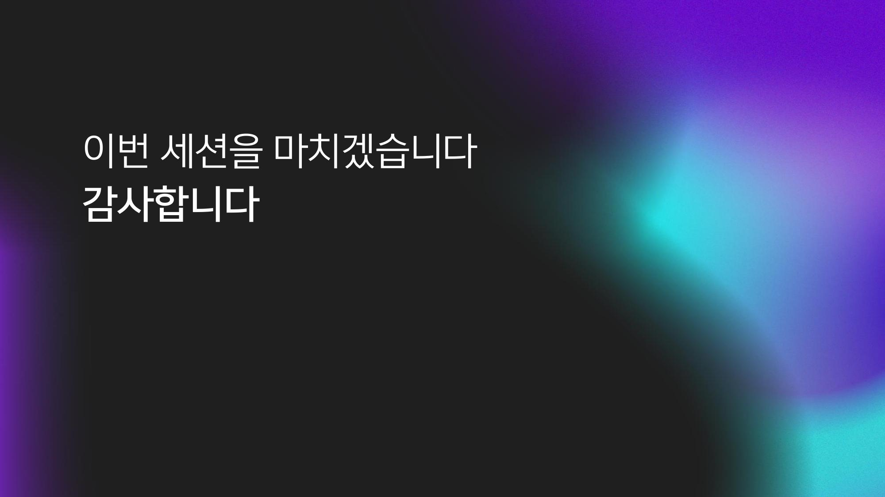

## Slide 1

---

**녹취록 요약:**
> 발표자는 AI 에이전트와 멀티 에이전트 시스템 구축에 대한 실제 개발자의 관점을 공유하며, 특히 MCP와 a2a(agent-to-agent) 통신 규격에 대해 설명합니다. 개발자에게는 아키텍처 공부가 중요하며, AI 도구를 활용하여 프로덕트를 만드는 데 집중해야 한다고 강조합니다.

## Slide 2

---

**녹취록 요약:**
> 발표자는 소프트웨어 개발의 근본적인 실력과 컴퓨터 사이언스 이해의 중요성을 강조하며, AI 도구는 가이드 없이는 제대로 작동하지 않는다고 지적합니다. AI에게 명확하고 구조화된 맥락을 제공하는 것이 중요하며, AI에게 기능 구현을 맡기기 전에 개발자가 충분히 고민해야 한다고 말합니다.

## Slide 3

---

**녹취록 요약:**
> 바이브 코딩이 활성화되면 비전공자나 비개발자도 쉽게 개발에 입문하여 MVP를 만들 수 있지만, 실제 프로덕트를 만들기 위해서는 근본과 실력을 겸비한 개발자가 필요하다고 강조합니다. AI의 한계로 인해 인간 개발자를 완전히 대체하기는 어려울 것이며, 이는 기존 개발자들에게 새로운 기회가 될 수 있다고 언급합니다.

## Slide 4

---

**녹취록 요약:**
> 발표자는 AI 에이전트 개발에 많은 시간을 투자하고 있으며, MCP(Model, Tool, Communication Protocol)와 a2a(Agent-to-Agent) 통신 규격에 대해 설명합니다. a2a는 에이전트 간의 통신을 담당하며, 리눅스 재단에 기부되어 오픈소스로서의 지위를 이어갈 것이라고 언급합니다.

## Slide 5

---

**녹취록 요약:**
> 발표자는 a2a 기반 에이전트 개발 과정에서 겪은 어려움을 공유하며, 새로운 기술 적용 시 한계점을 명확히 파악하고 핵심 아키텍처를 완전히 이해하는 것이 중요하다고 강조합니다. 또한, LLM이 지원하는 문서 형식을 활용하고, AI 도구와 튜토리얼을 잘 활용하여 개발해야 한다고 말합니다.

## Slide 6

---

**녹취록 요약:**
> 발표자는 `CLAUDE.md`를 통해 작업 계획을 구체적으로 세우고, AI에게 베이스 코드와 문서를 제공하여 코드 베이스를 파악하도록 지시합니다. `CC세바`와 같은 툴을 사용하여 토큰 사용량을 모니터링하며, AI가 계획을 세우고 코드를 생성하는 과정을 캡처하여 보여줍니다.

## Slide 7

---

**녹취록 요약:**
> 발표자는 AI가 서버와 클라이언트를 포함한 전체 시스템을 15분 만에 구현했음을 보여주며, 남은 작업은 통합 테스트와 디버깅이라고 언급합니다. AI가 생성한 코드가 완벽하지 않아 에러가 발생했지만, AI가 스스로 에러를 분석하고 수정하는 과정을 통해 문제 해결 능력을 보여줍니다.

## Slide 8

---

**녹취록 요약:**
> 발표자는 AI가 생성한 코드의 오류를 해결하기 위해 직접 샘플 코드를 제공하고, `ultrathink`와 같은 키워드를 사용하여 AI가 더 깊이 생각하도록 유도합니다. AI가 방향을 잡고 코드를 수정하는 과정을 보여주며, 작은 작업에 대한 디테일한 지시의 중요성을 강조합니다.

## Slide 9

---

**녹취록 요약:**
> 발표자는 Cursor Rules와 같은 프레임워크를 활용하여 AI에게 세세한 작업 지시를 내릴 수 있음을 설명하며, 클로드에게는 어려운 문제를 주고 `ultrathink`와 같은 매직 키워드를 사용하는 것이 효과적이라고 말합니다. 또한, AI가 생성한 코드를 GitHub에 공유하여 투명성을 확보하고 있음을 언급합니다.

## Slide 10

---

**녹취록 요약:**
> 발표자는 AI가 개발자를 대체할 수 있는 가능성을 언급하며, AI 코딩 팀을 만들 수 있는 단계가 되었다고 말합니다. 개발자는 기계와 언어의 중간 매개체로서 역할을 하며, 끊임없이 학습하고 적응해야 한다고 강조합니다. `CC세바`와 같은 도구를 통해 AI 사용량을 모니터링하는 것이 중요하다고 덧붙입니다.

## Slide 11

---

**녹취록 요약:**
> (이 슬라이드에는 녹취록 내용이 없습니다.)

## Slide 12

---

**녹취록 요약:**
> (이 슬라이드에는 녹취록 내용이 없습니다.)

## Slide 13

---

**녹취록 요약:**
> (이 슬라이드에는 녹취록 내용이 없습니다.)

## Slide 14

---

**녹취록 요약:**
> (이 슬라이드에는 녹취록 내용이 없습니다.)