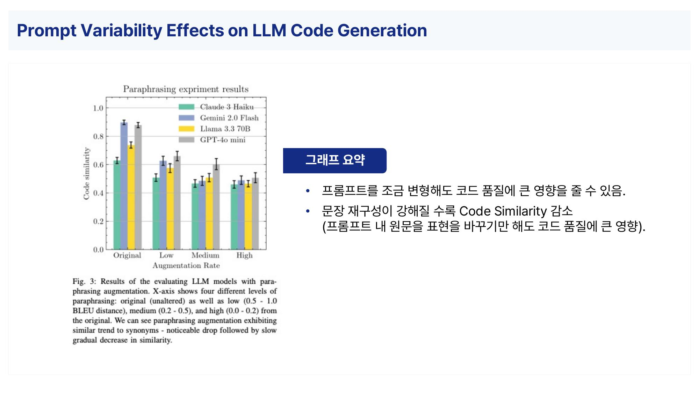
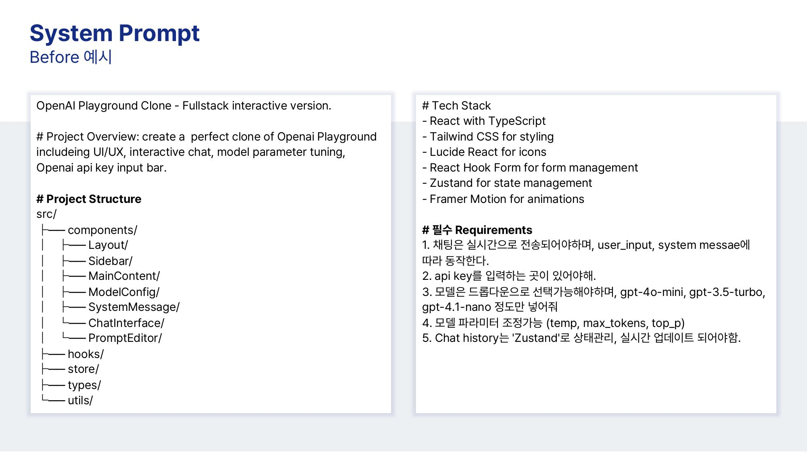
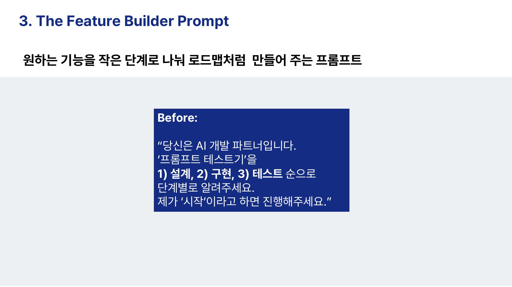
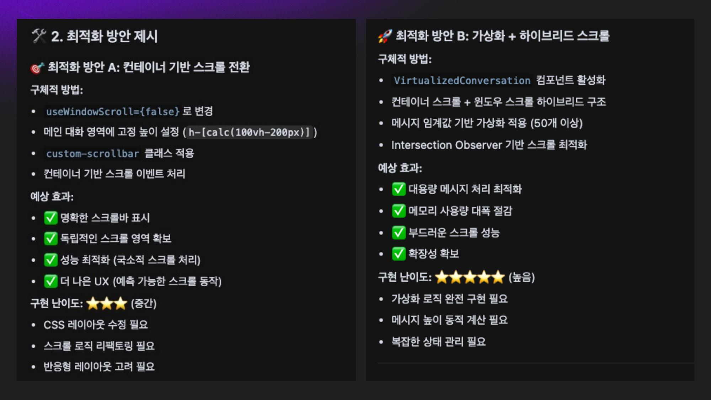

## Slide 1

---

**녹취록 내용:**
> section8
> 2025.07.01 화 오후 5:20 ・ 79분 8초
> 김영재
> 
> 
> 참석자 1 00:00
> 라는 관점에서 소개를 드리려고 해요. 여러분들이 쓰시는 거가 어떤 프로스팅이라고 한다면 이 바이브 코딩을 위해서 어떻게 하면 프롬 엔지니어링 수준으로 넘어갈까에 대해서 개를 드리겠습니다.
> 원래 이렇게 조용히 조용하나요? 제가 실습할 때 돌아다닐 때 돌아다녀도 놀라지 마세요.
> 컴퓨터의 실습 환경들 어제 제가 드린 소스 코드 혹시 다 받아오셨어요?
> 받아오신 분들 손 들어주시겠어요? 거의 다 못 받으신 분들은 강의 끝나고 슬라이드와 함께 다시 공유드릴 예정이니까 그때 봐주시고 소개할 시간이 아까워서 그냥 넘어가겠습니다.
> 컨셉은 핸드오 프렉틱스예요. 핸즈이라고 하면 직접 경험이 되겠죠.

## Slide 2

---

**녹취록 내용:**
> 그래서 직접 경험할 수 있는 어떤 환경들을 고심해서 만들어 왔는데 이렇게 좁은 장소에 사실 와이파이나 인터넷 환경이 갖춰지지 않을 것도 대비하여 준비해왔습니다.
> 
> 참석자 1 01:02
> 그래서 라이브 프라치를 준비를 했고 코드 워드로예요.
> 그래서 이 프론트 안에서 돌아가는 코드들과 맞물린 프롬프트는 어떻게 하는 게 좋을지에 대한 거예요.
> 우선 목차를 소개해 드리면 5가지의 목차를 가지고 있습니다.
> 첫 번째 크로프트가 사실 해보다 보면 진입 장벽이 굉장히 쉽죠.
> 자연어로 LLM이나 AI 플랫폼 사용하시면서 말을 걸 수가 있으니까요.
> 근데 하다 보면 굉장히 어려워요. 그런데 바이브 코딩 단에서 왜 어려운지를 말씀을 드릴 거고요.
> 두 번째는 레퍼런시스입니다. 코드에 있어서 정형화된 코드의 중요성이 정말 중요하게 논문들을 강조하고 있는데 프럼 엔지니어링 관점에서 중요한 것들을 두 가지 목적으로 전달드릴 건데 하나는 컨플세이션을 한 프롬프트고요.
> 다른 하나는 스트럭처드라는 구조화 프롬프트입니다.

## Slide 3

---

**녹취록 내용:**
> 세 번째는요. 제가 실제로 보는 바이브 코딩이 티 타임즈 편에 다은 코딩 편에 출연을 했지만 그 이전부터 그 영상에서도 말씀을 드려요.
> 
> 참석자 1 02:11
> 채팅 피티가 나오고 나서는 저는 매일 바이브로 코딩을 하고 PoC를 해서 개발자들과 이야기를 하고 제가 필요한 기능을 만들어서 쓰고 있는 사람이라 바이브 코딩의 워딩 자체가 바이브 됐다.
> 그래서 오늘날의 일은 아니라서 누적돼 막 이렇게 했더니 코드가 더 잘해 저는 비개발자니까 여러분들보다 아마 개발자분들보다 코드 보는 눈이 아마 까만 분일 거예요.
> 그런데도 잘 만들 수 있었던 프롬프트의 템플릿들이 존재하는데 그 템플릿들을 한번 소개해 드리는 게 세 번째 섹션입니다.
> 네 번째 데모 같이 해볼 수 있도록 비포앤 에포터로 준비를 했고요.
> 마지막에 브램거 마무리하면서 이 1시간 반 저는 1시간 반을 주셨어요.
> 왜냐하면 티 타임즈에서도 제가 말하는 거 아세요?
> 그래서 처음에 3시간 달라고 그랬는데 안 된대요.
> 저는 뭐 하루 종일이라도 말할 수 있는 사람이라서 그래서 오늘은 지각적으로 1시간 반을 거의 랩 하듯이 하겠습니다.

## Slide 4

---

**녹취록 내용:**
> 참석자 1 03:11
> 이 스키마를 항상 저는 어떤 프럼 엔지니어링을 주제로 말을 할 때 보여드리는데요.
> 익숙하시죠? 스키마 썰메이한 논문에서 피겨로 들어간 논문인데 저희가 어떤 종류의 LM을 쓰는지 이 LLM은 프롬프트라는 자연어를 통해서 사용할 수가 있죠.
> 그래서 프롬 엔지니어링이라고 한다면 단순히 챗gpt한테 안녕 오늘 너의 기분은 어때?
> 이런 저는 프롬프트 엔지니어링이라고 할 수 없습니다.
> 그냥 프롬프트겠죠 그래서 1번 2번 3번 단계에 거쳐서 결과물을 얻을 수가 있는데 1번에서 어떻게 넣느냐에 따라서 예를 들어 한 번에 이렇게 마음에 드는 결과물을 얻으신 적 있을까요?
> 없으시죠? 네 호응해 주셔서 감사합니다. 이쪽으로도 아이 컨택을 할게요.
> 한 번에 보통은 잘 안 나옵니다. 그래서 여기를 내 자연어 지식론을 어떻게 구성하느냐 따라서 결과물이 천차만별 다른 결과물 사용화 할 수 있는 결과물 제가 요즘 금융권에서 프로젝트 하고 있는데 숫자 때문에 되게 많은 고민들을 하고 있어요.
> 
> 참석자 1 04:29

## Slide 5

---

**녹취록 내용:**
> 이것도 자연어로 숫자 정확하게 뽑아내려면 결국은 일반 단계에 중점을 두어야 합니다.
> 그랬을 때요. 여러분들이 자연어이기 때문에 쓰고서 어느 정도 결과물을 받아요.
> 이거 생각보다 쉽네라고 하신다면 아직은 요 단계입니다.
> 트럼 엔지니어링은 어떻게 보면 어마스과 같은 것 같아요.
> 제가 3년 정도 프로 엔지니어로 놀이를 하면서 느낀 바는 이게 제2 외국어를 습득할 때처럼 이 디벨롭 단계가 한참 정체 구간이 존재를 하고 이런 식으로 정체 구간을 극복을 해야 뭔가 쓸 만하고 상용화할 수 있는 결과 그가 쓸 만한 코드 쓸 만한 코드를 정의한다라고 하면 진짜 서비스 레벨에서 완벽한 코드 들을 말씀드리는 거예요.
> 오늘은요 요거 얘기하려고 온 건 아니고 이 부분 얘기하려고 왔습니다.
> 어떻게 페인 포인트를 뚫고 넣어가지고 잘할 수 있는 방법들을 말씀을 드릴게요.
> 이게 됐잖아요.
> 
> 참석자 1 05:32
> 그래서 어려운 거를 왜 어려운지를 한번 제가 설명드리기 전에 옆에 계신 분들하고 아마 동주 님께서 옆에 계신 분들하고 얘기를 하라고 했겠죠.

## Slide 6

---

**녹취록 내용:**
> 제 수업을 들은 분들은 얘기를 참 많이 하는데 코드에 있어서 바이브 코드에 있어서 프로그래밍에 있어서 프로 엔지니어링을 할 때 어려움에 대해서 딱 1분만 긴장감도 풀고 지금 조금 앉아 계시니까 힘드시잖아요.
> 1분 정도 옆에 분들하고 얘기해서 의견을 스펙업 해 주세요.
> 1분
> 
> 참석자 2 06:10
> 뭐가 다른가
> 
> 참석자 1 06:11
> 최분들하고 친해지셨죠?
> 
> 참석자 2 06:14

## Slide 7

---

**녹취록 내용:**
> 질문이 뭐예요? 질문이 뭐 하는 거야? 질문이 질문
> 
> 참석자 1 06:22
> 그냥 어렵다라고 하시면 안 되고 뭐가 어려운지
> 
> 참석자 2 06:30
> 근데 처음에 저 작년에 작년에 온라인 온라인 투샷 투샷이나 뭐나 하면 그래 뭐라고 해야 되지 어플을 만드는 데 사는 그래도 LLM에 초기에 집어넣는 폼 폼스팅이잖아.
> 좀 그어 거지. 근데 이제 수준이 코딩을 시키는 프로 마케팅이랑 서비스 될 때는 얘가 어차피 카메라는 시에서 하는 거잖아 성장했다는 거지.
> 그럼 그렇긴 하지. 오늘도 서비스다는 얘기는 많이 하지 않아 아니다.
> 코드 생성됐다는 얘기하나 코드 제너레이션이잖아 내가 말한 건 이미 만들어진 코드 안에서 거기서 컴퓨터 해서 된다고

## Slide 8

---

**녹취록 내용:**
> 참석자 1 07:09
> 다 얘기하셨어요. 만약에 얘기할 시간 드리면 제 제 얘기
> 
> 참석자 2 07:21
> OK 나와 이거야.
> 
> 참석자 1 07:23
> 아까 어쨌든 어렵다. 해결이 됐을 거라고 보고요.
> 그렇죠 어렵죠 저도 어렵습니다. 그래서 최근에 나온 논문들을 열심히 이 바이브 코딩 컨퍼런스를 위해서 자료를 새롭게 만드는 과정에서 제가 어떤 걸 했냐면 일단 논문 조사 저는 선행 연구를 중요시하는 프레이컬 스토리도 중요시하지만 피오레디컬 프라이머를 되게 중요시합니다.
> 그리고 해외에 라이브 코딩이라는 영상을 봤어요.
> 다른 분들은 프로부터 엔지니어링을 할 때 바이브 코딩을 위해서 어떻게 하는가 그것들을 요약하고 제 만의 어떤 노하우를 전달해 왔는데 그 첫 시작인 논문 정리입니다.

## Slide 9

---

**녹취록 내용:**
> 영국 켈브리지 대학에서 이 논문을 발표를 했어요.
> 여기 보시면 제가 이거를 이제 준비하면서 저희 회사에 시니어 개발자가 바이브 코딩을 어떻게 했는지를 관찰을 했거든요.
> 터미널 창에 그 개발에 필요한 용어들을 넣으면서 정말 간단하게 명령을 하는 그런 모습이 관찰이 됐단 말이에요.
> 
> 참석자 1 08:28
> 그랬을 때 프롬프트를 어떨 때는 단어로 어떤 때는 문장으로 넣으시는 거예요 그런 걸 바로 드레이 아웃 레드릭이라고 합니다.
> 프로포트 안에서의 변동성이 크면 나온 코드의 결과물의 유사도가 상당히 떨어지거나 누적 코드 비효율적인 코드가 나온다라는 거예요.
> 그랬을 때 중요한 포인트는 여기 바로 이 타이포 여기 볼드 처리된 곳인데요.
> 타이포라고 하는 오타 여러분들 코드 쓰실 때 오타 자주 쓰세요?
> 그쵸? 오타를 나는 안 된다라고 하시는 분들 오픈 소스 가져다가 사용하시면 그렇겠지만 오타가 정말 중요하고 프로포트에 있어서 그리고 오미영 네 프로포트에서 명령을 할 때 같은 단어를 계속 쓰실 때도 있고 뭔가 동의어로 유사한 단어를 반복해서 쓰실 경우가 있잖아요.
> 그랬을 때 동의어에 대한 영향성이 엄청 크고 패러프레이징도 같은 개념입니다.

## Slide 10

---

**녹취록 내용:**
> 이 3개가 프롬프트에서 코드 결과물을 낼 때 엄청 중요하다고 해요.
> 그리고 저 같은 경우는 오타를 정말 많이 냈는데 그래서 키보드를 바꿨거든요.
> 
> 참석자 1 09:41
> 좋은 게임 키보드 소리 나는 걸로 그래서 상당히 오타이를 잡지는 못했어요.
> 지금 색깔인가 봐요. 그래서 오타 에 대해서 얼마나 이 브라우프에서 보여주는 결과가 얼마나 이 오타에 취약한지 그리고 오타를 냈을 때 지금 저희가 LLM마다 비교한 논문도 있는 거예요.
> 너무 재미있게 그랬을 때 지금 모델이 4개가 나옵니다.
> 제미나이 2.0 플래시 포워드 크림 GPT 4 미니 라마 3.3 이 모델 중에서 그나마 오타를 잘 견뎌내는 모델은 제미나이였어요.
> 제미나이는 세너님 유리어에도 잘 견딘대요. 그다음 결론을 보시면 프로포트 변형이에요.
> 그래서 처음에 명령했을 때를 조금 바꿔서 나 이 부분을 고치지 말고 다른 거를 코드 생성해줘라고 많이들 하실 텐데 그 문장을 처음에 넣는 거랑 뒤에 넣었을 때 변형이 많이 된다면 잘못된 코드를 생성한다라는 그런 의미입니다.
> 그래서 문장 재구성이 강해질수록 코드 시뮬러리티가 감소한다.

## Slide 11

---

**녹취록 내용:**
> 그래서 품질에 정말 큰 영향을 준다.
> 
> 참석자 1 10:53
> 이 논문에서 저희가 볼 수 있는 시사점은 바로 세 가지입니다.
> 첫 번째는 바이브 코딩의 결과물을 위해서 신뢰성을 확보를 해야 되는 상황이죠.
> LLM은 아시겠지만 제가 오늘 드린 소스에 비폴 데피터 폴더를 보셨을 거예요.
> 비포 같은 경우에는 생성할 때마다 결과가 달라져요.
> 왜 프로피트를 잘 못 먹거든요. 애프터 같은 경우는 누가 거절하다 생성을 하더라도 일관된 결과를 낼 수가 있어요.
> 생성형 aii이기 때문에 어느 정도 변형은 있을 수 있으나 신뢰성을 확보하기 위해서는 올바른 크롬 엔지니어링이 필수임을 말씀드릴게요.
> 두 번째인데요. 비전문가 여기서 비전문가라고 하면 프럼 엔지니어링 비전문가입니다.
> 프로 엔지니어링도 프로페셔널하게 쓰시는 분들이 존재하죠.

## Slide 12

---

**녹취록 내용:**
> 예를 들어 LLL 모델 사에서 나오는 프론트 쿠북 같은 거를 보시면 프로 엔지니어링을 연구한 분들이 썼기 때문에 전문가라고 할 수 있겠죠.
> 
> 참석자 1 11:53
> 그래서 이 모델은 이렇게 쓰셔야 돼요라고 연구를 한 사람에 비해서 아무래도 b 프롬 엔지니어링 전문가들은 작성에 있어서 어려울 수밖에 없고 그렇기 때문에 안정적인 결과를 내기가 어려울 수 있어요.
> 세 번째 시사점은 제가 바이브 코딩을 하는 거는 제 개인적인 차원의 일일 텐데 전사적인 차원에서 이제 AI가 생성한 코드랑 협업을 해야 되는 관점에서는 이 코드를 품질 관리를 해야 되는 이슈가 생깁니다.
> 그랬을 때 어떻게 품질 관리를 프롬프트 단에서 할 수 있냐라고 한다면요.
> 누가 생성하더라도 일괄적인 결과를 내어야 된다라는 거죠.
> 여기에 시사점까지 괜찮으세요? 제가 너무 천천히 말하나요?
> 지금까지 다 남자분들이었죠 하이톤으로 하겠습니다.
> 두 가지 방법을 소개해 드릴 건데 하나는 컨퍼세이션 한 프롬프트 대화형 프롬프트라고 할 수 있고 대화형 프롬프트가 정말 중요합니다.
> 두 번째는 프롬프트 구조화예요.

## Slide 13

---

**녹취록 내용:**
> 참석자 1 12:58
> 아까 전에 정렴하지 않아 언스트럭처드하고 프롬프트를 잡을 수 있는 방법은 스트럭처드한 프롬프트 그리고 그냥 명령어가 아니라 대화를 하면서 하는 프롬프트의 느낌을 바로 보여드리겠습니다.
> 첫 번째는 컨퍼세이셔널 프롬이에요. 그래서 논문을 또 읽어봅시다.
> 이 논문은요 LLM을 쓰시면서요. 여러분들이 답변 결과를 받을 때 혹시 응답 패턴에 대해서 예의주시한 분들 있어요 내가 이 단어를 넣으면 이 LM은 꼭 이렇게 대답해라는 게 패턴입니다.
> 리스펀스 패턴인데요. 이 로모는 그런 걸 연구하는 거예요.
> 논문의 제목이 그 논문 다른 논문이군요. 뒤에 나오고 이거 같은 경우는 대화식의 프롬프트가 코드 결과물에 있어서 어떤 내용을 향상시켰는가를 연구한 건데 결과의 포인트만 말씀드리면 대화형 프로포트 그러니까 사용 모델한테 뭔가를 입력하게 하고 결과를 받고 피드백을 다시 던지고 룸라고 하죠.
> 대화용을 적용을 하면 이 소프트웨어 개발 코드의 프로그래밍 결과도 에큐러시가 굉장히 높았다라는 연구 논문입니다.
> 
> 참석자 1 14:15
> 그래서 논문에서 소개하는 대화용 프론트가 9개나 돼요.

## Slide 14

---

**녹취록 내용:**
> 한번 쫙 읽어보시면서 이거 찍지 않으셔도 제가 공유를 드릴 예정인데 왜 다들 찍고 계시죠?
> 1번부터 9번까지 여기 오타가 있나요? 저 오타 진짜 많이 냅니다.
> 양해해 주시고 옆에 분들하고 하나하나 읽어보면서 자신의 프로포트 바이브 코딩뿐 아니라 평소에 프로포트요 그게 이거에 얼마나 개수가 많은지 이거에 부합하고 있는지를 또 한 1분 정도 얘기하고 가실게요.
> 제 거는 1시간 반이라서요. 얘기도 좀 하고 실습도 좀 하고 그럴 예정이에요.
> 지금부터 딱 1분 정도만 말씀해 보십시오.
> 
> 참석자 2 15:03
> 아니 저 프롬프트 엔지니어링 판보시에서 전화한 건데 저 중에 몇 정도를 몇 가지 정도를 하니 특정 키워드 하나 더 많은 맥락 맥락은 많이 하지 그리도 많이 하지 구체적인 오류 지적부터 수정서 저것도 내가 하는 거야.
> 올바른 방향으로 유도할 수 있는 질문하기도 하지 검증도 해 검증 안 하 검증은 잠깐만 예시를 가끔 해 구체적인 설명은 잘 안 하지 그렇지만 샘플로 해주지 샘플 다른 버전도 내가 샘플로 해주지 나 저 중에 8가지는 하는 것 같은데 내
> 
> 참석자 2 15:45

## Slide 15

---

**녹취록 내용:**
> 다 할 수 있게 아빠는 맛있는 메뉴를 추천해 줘야 면은 맛있는 메뉴가 구체적으로 많아서 지금 메뉴 여러 개 추천해주고 예시가 있는 거고 그렇지 그러면 그렇게 쓰면 여러 번 아니 근데 이게 한 번에 한 번에 다 한 건 아니고 답변 올렸을 때마다
> 
> 참석자 1 16:06
> 그럼 더 하세요.
> 
> 참석자 2 16:08
> 오히려 코드 잘하는 사람은 그냥 자기가 해보는데 나는 오히려 저기 내가 만들었던 샘플 코드 하나 이렇게 주면서 이것도
> 
> 참석자 1 16:15
> 다 손 뜨셨죠? 1번부터 9번까지 그리고 이거 어쨌든 시간 제약이 있는 강의라서요.
> 끝나고 질문 같은 거 있으면 제 채널이나 게시판에 올려주시면 답변드리겠습니다.

## Slide 16

---

**녹취록 내용:**
> 1번 같이 읽어봐도 돼요. 네 지치셨으니까 같이 또 읽어봐 주세요.
> 제가 1번 보면 그 내용 한번
> 
> 참석자 2 16:37
> 빨리빨리 좀 하지
> 
> 참석자 1 16:42
> 시간은
> 
> 참석자 2 16:43
> 5만 원 샘플을 줘야 돼. 5만 원이

## Slide 17

---

**녹취록 내용:**
> 참석자 1 16:49
> 4번 5번
> 
> 참석자 2 16:55
> 미추 수지 같아 안 맞아.
> 
> 참석자 1 17:00
> 7번 8번 9번 3 읽은 사람 손 들어줘요. 3을 왜 읽으시는 거예요?
> 유머 시사

## Slide 18

---

**녹취록 내용:**
> 참석자 2 17:16
> 에로 에로 에로
> 
> 참석자 1 17:17
> 일부분도 그건 사실 저희가 하고 있는 거예요. 그런데 이 논문에서 말하는 거 우리 이미 하고 있는데 다른 분들도 대화형의 관점이 포인트거든요.
> 그랬을 때 대화형이란 어떤 건지를 한번 아마 대부분 이거 한다.
> 그래도 더 많은 예시 보여줘 혹은 잘못된 부분 검증 프로포트 생성해줘 뭐 이렇게 하시겠죠 그래서 제가 오늘 이거에 해당하는 크로프트의 샘플들을 준비해 왔습니다.
> 우선 머스텍 프로먼 탑 바이브 프로큐어 라이즈를 보시겠습니다.
> 이 논문에서 그런 걸 조사해요. 바이브 코딩을 하실 때 LLL으로 코딩을 하실 때 개발자가 많이 하는 행위를 5개로 나열을 한 거예요.
> 그것도

## Slide 19

---

**녹취록 내용:**
> 참석자 2 17:59
> 인터넷도 많이 공부해야 돼.
> 
> 참석자 1 18:00
> 코드 엄청 길게 생성해 주니까 코드 요약해줘를 많이 하시면 돼요.
> 두 번째는 코드 생성 및 번역 번역은 왜 하시는지 저는 잘 이해를 못했지만 아마 이제 한국어로 번역해줘 뭐 이런 거겠죠.
> 그랬을 때 이게 두 가지가 가장 많이 바이브 코딩해서 요청하시는 거고 그랬을 때 조금 더 작게 이렇게 쪼개보면 코드 서버라이제이션 칼럼 코드 제너레이션 칼럼 코드 트랜스페이션 칼럼 그랬을 때 다 유사해요.
> 그랬을 때 대화용으로 요청하는 것이 여기 보시면 아웃퍼폼 너무 잘하더라 성능을 향상시키더라라고 했습니다.
> 그래서 대화형이 무엇인가를 지금부터 말씀드릴게요.
> 대화형이라고 하는 우선 구조화가 되어야 합니다.
> 그래서 구조를 쓰면서 대화용으로 바꿔볼 건데요.

## Slide 20

---

**녹취록 내용:**
> 프로포트 요소를 활용을 하는 거고 LMB 읽기 시험 구조로 바꾸는 게 기본 컨셉이에요.
> 
> 참석자 1 19:02
> 현재의 프로포트는 어 자연어보다 저희 인간의 우리 인간의 자연어보다 약간 코드처럼 쓰는 게 더 잘 알아듣고 있어서 그런 관점에서 말씀드리고 그거를 하기 위한 방법이 단순하게는 세 가지예요.
> 그런데 제가 개발자 수업을 하면서 패스트 캠퍼스의 오프라인 개발자 수업을 하면서 개발자분들이 어떻게 프로포트를 쓰시나 120명 넘게 프로브들을 봤는데 대부분 이 기본적인 것들을 못하시고 계세요.
> 우선 인덱싱 진짜 중요하고요. 카테고리 만들어주는 거요.
> 그다음에 말단을 쓰고 딜리미터를 써서 비호 쓰고 왜 로스트윈더 미들 현상이 있으니 기호를 어떻게든 써야 되는데 그거를 매칭하시고 그다음에 수도 프로팅을 해야 된다라고 설명을 드릴게요.
> 하나하나 살펴보면 굳이 이거에 대해서 제가 설명을 디테일하게 하지 않아도 이미 말대환의 용도에 대해서는 다 아시죠?
> 다만 프롬프트에 담지 않으시는 문제가 있습니다.
> 그랬을 때 저는 모든 프로포트 앞에 이렇게 하이폰을 꼭 붙여주고 있어요.

## Slide 21

---

**녹취록 내용:**
> 참석자 1 20:12
> 특히 코드 생성할 때도 그리고 1번 2번 3번 얘가 처리해야 될 순서에 대해서 말을 하고 있고 가끔 가다 예를 들어서 어떤 CN 함수에 대해서 수정해줘 제 디렉토리 중에 수정하고 싶은 부분을 지목할 때요.
> 그냥 그 부분이라고 안 하고 이렇게 별표나 별표 집기를 사용을 해가지고 이 자연어를 조금 더 LLM이 잘 인지할 수 있게 하는 그런 장치를 쓰고 있는데 제가 쓰는 기호에 대해서 한번 설명을 정리를 해 왔습니다.
> 가장 많이 하는 질문이 기호예요. 기호에는 딱히 규칙이라는 게 없는데 제가 프로포트를 쓸 때는 어떤 기어를 어떤 용도로 쓰나요라는 질문이 정말 프레커니하게 많이 받고 있는 질문이어서 오늘 한번 보여드릴게요.
> 일단 딜리미터라고 하면 구분하는 거죠. 자연어와 자연어를 구분한다라는 것도 있고 문단과 문단을 구분한다.
> 센테스와 센텐스를 구분한다입니다.
> 
> 참석자 1 21:11
> 그래서 포맷팅을 할 때는 포맷이 달라질 때는 퍼센 어떻게 생 이거 API의 파라미터가 달라지는 것도 퍼센트 이런 식으로 한 기호를 여러 가지 목적에서도 쓸 수가 있고 느낌표 어시스턴트 네일 유절, 네임 중괄호 물결 그다음에 이거 백틱 기어라고 하죠.
> 그거 쓰고 마침표와 쉼표도 항상 써주고 있습니다.
> 마침표 문장이 문장이 길어지게 되면 마침표를 안 쓰시는 경우가 있는데 저는 꼭 마침표와 쉼표로 그 문장이 어디에서 끊어지고 어디에서 갈라지는지를 표시를 해 주고 있어요.

## Slide 22

---

**녹취록 내용:**
> 그리고 코너 같은 경우는 어떤 함수의 정의들 명명하는 방식 셀아이코너는 이게 다 이제 어떤 문장의 장치를 그대로 쓰는 거겠죠.
> 그리고 가끔은 질문 표시도 해요. 제가 아크레어 거에 대해서 질문을 이렇게 놓고 프로포트에 쓰기도 합니다.
> 괄호 같은 경우에는요. 소가호, 중괄호 대괄호를 쓸 수 있는데 제목을 만들어줄 때 많이 쓰고 있어요.
> 그래서 이거를 꼭 한번 써보심을 권유드리고 오전에 태리 님 보셨죠?
> 
> 참석자 1 22:30
> 김태현 님 실은 어떤가요? 잘생기셨죠? 태리 동태 님 라이브에 나가서 나는 그냥 저는 정말 아무렇지 않게 쓰고 있었었는데라는 방법이 이 방식 신기하다라고 했던 게 바로 이 수도 프로틴 파이썬이 프로팅입니다.
> 근데 신기한 거는요. 개발자분들이 오히려 수도 코드를 잘 못 쓰시더라고요.
> 저는 개발에 대한 까만론이기 때문에 수도 코드를 잘 쓰거든요.
> 써놓고 다 제가 쓰면 다 수도예요. 다 가짜 코드 그럴 때 2021년도 3년도도 그렇고 채즈 뷰티가 나오기 전에 이미 프럼 엔지니어링에서 예를 들어 추출 아니면 뭔가 정의하는 거 스텝을 나눌 때 많은 논문들이 파이썬 코드를 사용을 해라 자연어로만 쓰지 말고 그 중간에 코드 프론칭을 써라라고 제안을 합니다.
> 그랬을 때 효과는 LLL이 할루시네이션을 없앨 수 있고 줄일 수가 있고 그다음에 오해의 여지를 줄일 수가 있다라는 거예요.

## Slide 23

---

**녹취록 내용:**
> 그러면 뭐가 수동 프론팅인지는 여기 제가 하이라이링 해 놓은 부분이에요.
> 
> 참석자 1 23:45
> 자연으로 쭉 지시를 하다가 갑자기 수동 프론팅 이 나오죠.
> 그래서 이거를 한번 보시면 아마도 프롬 엔지니어링 하실 때 작은 모델일수록 뷰 샷을 많이 쓰실 거예요.
> 퓨샷 같은 경우는 어떤 거를 예시를 많이 주는 방식이겠죠 그냥 예시는 요거야라고 하는 방식이 아니라 여기도 이렇게 샷을 수도 코드로 처리를 하는 것을 볼 수가 있습니다.
> 여기도 똑같아요. 뭔가를 분류를 할 때 이프 엑스 리턴 엑스 이렇게 만들어주는 그 스트럭처드 프론트고요.
> 저는 바이드 코데리아는 무조건 요 스톱 프론틱이나 혹은 구조화된 프로티를 써야지만 안정적인 결과가 나오는 경험하고 있어요.
> 그랬을 때 진짜 그럴까 하는 분을 위해서 이 논문에서 스트라이 한 것들을 이 그래프에 담아서 보여줄 수가 있는데 우선 코드 지시어 코드를 사용한 스톱 프롬팅의 지시어를 사용한 거랑 그래 자영어로만 지시를 사용한 거랑 뭐가 정확도가 여러 가지 테스트에 있어서 높았을까라고 한 결과예요.
> 
> 참석자 1 24:55

## Slide 24

---

**녹취록 내용:**
> 보시면 당연히 이 코드 베이스로 한 프로포트의 결과물이 정확도를 끌어올릴 수 있었다는 그런 결론입니다.
> 그래서 꼭 한번 해보시고요. 이게 또 얼마 전에 나온 논문이에요.
> 아까 전에 말했던 그 프롬프트의 패턴이라는 게 있습니다.
> LM의 패턴 저희가 먹는 것도 중요하지만 답변을 받고 그 답변을 이용해서 그다음 작업을 하는 것도 중요하잖아요.
> 그랬을 때 이 연구진들은 반복 뭔가 한 번 제가 제가 또 본 오저베이션은 뭔가 개발을 하실 때 뭔가의 기능을 목적으로 두시고 대부분 한 번에 나오길 원하시는 것 같아요.
> 맞아요. 왜 그러시죠? 한 번에 나오는 거를 되게 선호하시더라고요.
> 그랬을 때 잘 안 나오잖아요. 그래서 대화를 막 티키타카를 AI로 하면서 만족스러운 코드 출력을 높이려고 할수록 더 이상 어디서 손을 걷잡을 수 없이
> 
> 참석자 2 26:01
> 주상원이 들려 있지

## Slide 25

---

**녹취록 내용:**
> 참석자 1 26:02
> 좋지 않은 코드들이 나온다라는 그런 건데 그럼 그거 어떻게 줄일 거야라고 하는 해결책을 나한테 보여주는 그런 논문이에요.
> 정답은 이 두 개 있습니다. 컨텍스트랑 인스트럭션 그리고 레스 p 포인트는 구조화된 크로프트 패턴이 적은 대화만으로도 여러분들이 원하는 결과물을 빠르게 얻을 수 있다라는 거예요.
> 그래서 그런 프로포트 패턴이 대체 뭐야 컨텍스트랑 인스트럭션이 뭐야라고 한다면 이 두 가지가 될 것 같아요.
> 가끔 프롬프트에는 매직 월드가 있어요. 그 어떤 모델의 추론 성능을 트레버 해가지고 못 풀던 문제 풀고 acc가 높아지는 그런 문장들이 있습니다.
> 그게 하나가 레스 핑크 스텝 바이 스텝이라는 제로샤 cot라는 문장 있죠 많이들 아시죠?
> 혹시 바이브 코딩하실 때도 레스 핑크 스텝 바이 스텝을 쓰시나요?
> 안 쓰세요? 쓴다 한번 손 들어 주실까요?
> 
> 참석자 1 27:04
> 저 궁금해서 한번 레스팅크 스텝 바이 스텝을 쓴다 안 쓴다 안 드시는 분들은 모르겠다 모르시는 거죠 우선 라스팅 스텝 바이 스텝보다는 어떤 스텝 바이 스텝이나 여기 위에 하이라이닝을 해놓은 것들이 키 월드로 해당이 됩니다.

## Slide 26

---

**녹취록 내용:**
> 그래서 스텝 바이 스텝 하게 해줘. 너희 레시피를 잘 패턴을 만들어줘 혹은 가이드를 따라줘라는 이 단어 하나의 쓰임이 정용화된 코드를 만들 수 있다라는 논문이고요.
> 왼쪽 보시면 베이스 온이라는 단어는 뭐에 기반해서라는 어떤 참고 출처를 주는 단어죠.
> 그래서 베이스트 온과 위드 데스 인포메이션 이 어떤 제로에서 뭔가를 생성하는 것보다 API라든지 아니면은 참고할 수 있는 레퍼런스 소스라든지 그 코드 기반으로 해서 해줘라고 이런 컨텍스트를 주고 지시를 패턴화했을 때 제가 해보니 패턴화를 할수록 더 잘하더라고요.
> 그래서 여기까지가 논문을 통해서 살펴볼 수 있는 바이브 코딩의 팁이라고 할 수 있습니다.
> 
> 참석자 1 28:20
> 지금부터는 제가 하는 어떤 에이 베를 테스트 드 포럼스 폴 라이브 코딩에 대해서 말씀을 드릴게요.
> 여기 제가 배트리라고 썼어요. 저는 코드와 싸워야 되는 입장이라 코드와 싸워야 되는 입장이라서 실전에서 사용할 수 있는 프롬프트라는 뜻입니다.
> 그래서 여러분들 지금 컴퓨터 다 켜놓고 계시죠? 그랬을 때 이제 만들어볼 건데요.
> 이 배틀 판을 소개해 드리지 않고서 한번 만들어 보실 예정이에요.
> 환경이 얼마나 갖춰질지는 모르겠지만 그래서 나를 프론트를 듣고 에프터를 한번 체험해 보시라고 준비한 시간이고요.

## Slide 27

---

**녹취록 내용:**
> 뭐를 만들 거냐라고 한다면 혹시 플레이 그라운드라는 프로포트 테스트 툴에 대해서 아시나요?
> 아시는 분 손 들어주세요. 모르시는 분 손 들어주세요.
> 네 좋습니다. 그럼 한번 설명을 하겠습니다. 오픈 AI 하겠습니다.
> 오픈 AI에서 제공하는 플레이 그라운드라는 거를 한번 만들어 볼 건데요.
> 여기는 뭐를 할 예정이냐면 혹시 여기 있습니다.
> 
> 참석자 1 29:29
> 오픈 AI에서 제공하는 플레이 그라운드라는 거를 한번 만들어 볼 건데요.
> 여기는 뭐를 할 예정이냐면 혹시 이거를 보실 수가 있나요?
> 
> 참석자 1 29:46

## Slide 28

---

**녹취록 내용:**
> 이걸 여기다가 띄워야 되나요? PPT를 끄고 해야 되나 보겠습니다.
> 오픈 AI에서 제공하는 플레이 그라운드라는 거를 한번 만들어 볼 건데요.
> 여기는 뭐를 할 예정이냐면 혹시 이거를 보실 수가 있나요?
> 
> 참석자 1 30:09
> 이걸 여기 따로 띄워야 되나요? PPT를 끄고 해야 되나 보네요.
> 
> 참석자 1 30:18
> 됐습니다. 여기서 오픈 AI의 플레이 그라운드라는 툴을 잠깐만 소개해 드릴게요.
> 프로포트를 다양한 환경하겠습니다. 오픈 AI에서 제공하는 플레이 그라운드라는 거를 한번 만들어 볼 건데요.
> 여기는 뭐를 할 예정이냐면 혹시 이거를 보실 수가 있나요?

## Slide 29

---

**녹취록 내용:**
> 참석자 1 30:46
> 이걸 여기다가 띄워야 되나요? PPT를 끄고 해야 되나 보네요.
> 
> 참석자 1 30:56
> 됐습니다. 여기서 오픈 AI의 플레이 그라운드라는 툴을 잠깐만 소개해 드릴게요.
> 프롬프트를 다양한 환경 조건에서 테스트할 수 있는 베드라고 할 수가 있어요.
> 여기는 놀이터 보시면
> 
> 참석자 1 31:20
> 네 여기 보시면은 되게 심플해요. 왼쪽에는 그냥 프로보트 카테고리들이 있고 여기서 이제 채팅창에 프롬프트를 넣고서 테스트를 하는 건데 저희가 만들어볼 거는 컴페어라는 도구가 될 것 같아요.

## Slide 30

---

**녹취록 내용:**
> 그래서 한번 소개를 드리면 여기 GPT 모델들을 선택할 수가 있죠.
> 이 모델들을 선택 좀 크게 키울게요. 모델들을 현재 오픈 AI로 제공하는 여러 가지 모델들의 리스트업을 할 수가 있어야 됩니다.
> 그래서 이런 식으로 모델 리스트를 볼 수가 있고 그다음에 텍스트의 볼넷이 텍스트인지 제이슨 오브젝인지 제이슨 스키마인지를 설정할 수 있는 탭도 바이브 코딩으로 만들어야 되고 펑션은 안 만드셔도 되고 이 프로포트를 미세 조정한다라고 했을 때 조정할 수 있는 값들이 여러 개가 있어요.
> 타겟습니다. 오픈 AI에서 제공하는 플레이 그라운드라는 거를 한번 만들어 볼 건데요.
> 여기는 뭐를 할 예정이냐면 혹시 이거를 보실 수가 있나요?
> 
> 참석자 1 32:27
> 이걸 여기 따로 띄워야 되나요? PPT를 끄고 해야 되나 보네요.
> 
> 참석자 1 32:37
> 됐습니다. 여기서 오픈 AI의 플레이 그라운드라는 툴을 잠깐만 소개해 드릴게요.

## Slide 31

---

**녹취록 내용:**
> 프롬프트를 다양한 환경 조건에서 테스트할 수 있는 베드라고 할 수가 있어요.
> 여기를 보시면 네 여기 보시면은 되게 심플해요. 왼쪽에는 그냥 프로보트 카테고리들이 있고 여기서 이제 채팅창에 프롬프트를 넣고서 테스트를 하는 건데 저희가 만들어볼 거는 컴페어라는 도구가 될 것 같아요.
> 그래서 한번 소개를 드리면 여기 GPT 모델들을 선택할 수가 있죠.
> 이 모델들을 선택 좀 크게 키울게요. 모델들을 현재 오픈 AI로 제공하는 여러 가지 모델들의 리스트업을 할 수가 있어야 됩니다.
> 그래서 이런 식으로 모델 리스트를 볼 수가 있고 그다음에 텍스트의 볼넷이 텍스트인지 제이슨 오브젝인지 제이슨 스키마인지를 설정할 수 있는 탭도 바이브 코딩으로 만들어야 되고 펑션은 안 만드셔도 되고 이 프로포트를 미세 조정한다라고 했을 때 조정할 수 있는 값들이 여러 개가 있어요.
> 템퍼러처 맥스터크 하피까지만 한번 만들어 볼게요.
> 
> 참석자 1 33:54
> 이런 빠가 나오면서 여기에 예를 들어서 한 번씩
> 
> 참석자 1 34:05

## Slide 32

---

**녹취록 내용:**
> 그래서 코딩에 대해서 세 줄로만 알고 이렇게 하면 모델 지금 모델이 같아서 결과가 비슷할 건데 결과를 제고할 수 있는 화면이에요.
> 이게 플레이 그라운드라는 놀이터 프로포트 놀이터를 한번 만들어볼 건데 제가 하나 띄워드릴 테니까 요 그대로 한번 서서를 켜주시고 만들어 보십시오.
> 만드실 수 있겠죠 그 오픈 AI 플레이 그라운드 이 창을 그냥 그대로 한번
> 
> 참석자 2 34:40
> 안 들어가
> 
> 참석자 1 34:41
> 시작해 보세요. 프로포트 한 10분 정도 드릴게요.
> 그래서 10분 정도 요거 그대로 프로포트 넣으시고 커서에서 제 소스 코드 쓰지 마시고 여러분들의 프로포트로만 이 ab 테스트를 할 수 있는 환경을 PoC로 한번 만들어 보시는 거예요.
> 돌아다닐 테니까 궁금한 거 말씀 주시고 돌아다녀도 될까요?

## Slide 33

---

**녹취록 내용:**
> 인터넷 안 다녀도 돼요.
> 
> 참석자 2 35:07
> 다른 데로 가자. 다른 네트워크 mt mt mt로 바꿔.
> 뭐야 아까 패소드가 뭐였냐 패소드가 뭐냐 이거 1 2 3 2 8 바꾸지 마.
> 바꾸지 마. 안 되겠다. 얼른 들어가자. 로그인이 안 되지 녹음이 돼 24 24 680 레벨 268 다른 데로 옮겨가지고 회계에서 저도 안 들어가네요.
> mt로 가 mt로 다른 데로 가 봐. 지금 뭘 하라고 하는 건데 커서가 아니고
> 
> 참석자 2 36:08
> 뭐라는 거야 근데 똑같이 만들어 똑같이 플레이 그라운드 플레이 그라운드에 사는 거 아니야 에서 하는 바이브 코딩 써가지고 똑같이 만들

## Slide 34

---

**녹취록 내용:**
> 참석자 3 36:43
> 저거를 만들려고 태현이 이 무거운 분위기 태연이 되셔가지고 지금 첫
> 
> 참석자 2 36:50
> 안 돼 안 돼 이제 안되지 안 됩니다. 인터넷 안 되지 인터넷이 안 돼요.
> 이 7시 a로 가 b로 가 봐 b
> 
> 참석자 4 37:01
> a랑 mt를 갔는데요.
> 
> 참석자 2 37:04

## Slide 35

---

**녹취록 내용:**
> b b 해봐 안 돼 이거 이런 잘 되는
> 
> 참석자 2 37:16
> 피가 아예 안 드네. 아 있다 됐어 아직 어
> 
> 참석자 2 37:34
> 다 쓰니까 그런 거 같아요. 이사 연결도 안 되네 되냐 너도 안 되지 인터넷 안 되지 돼 저 되는데요.
> 돼요. 돼요. 얘 선착순 먼저 잡은 사람 어디 먼저 먼저 연결된다 커서는 됐나 아예 아예 안 돼요.
> 커서 다 보여요. 저도 안 되네요. 그렇죠 끊겼어 뭐라고 할까?
> 바이브 코딩에 대해 그냥 테더링해서 해야겠는데 그게 나을 수도 있겠다.

## Slide 36

---

**녹취록 내용:**
> 참석자 4 38:14
> 고금량 많이 들어가지 않았나
> 
> 참석자 2 38:43
> 날카워 이런 거
> 
> 참석자 1 38:45
> 서론만 말해놨는데 시간이 너무 금방 가가지고
> 
> 참석자 2 38:49
> 컨덕션 표현

## Slide 37

---

**녹취록 내용:**
> 참석자 1 38:50
> 안 되겠어요 철회하겠습니다. 그러니까 뭐를 하셔야 되냐면 가셔서 꼭 해보세요.
> 오픈 AI 프레이 그라운드 요 슬라이드 공유드리면요 하셔야 될 UI가 정확히 표현이 문장이 써져 있어요.
> 그래서 아예 커서에서 새 창을 띄우시고 제가 드린 소스 코드 없이 커서에서 새로운 풀집으로 한번 해보시길 추천해 드려요.
> 그랬을 때 어떻게 나오는지 꼭 한번 보시고 그거 기반해서 그게 혹시 어려우신 분들은 제 리포 소스 코드를 쓰셔도 좋습니다.
> 송구하지만 시간 때문에 그냥 이어가겠습니다. 이 테스트 툴을 만든다라는 거가 오늘의 프라이텍스로 나와야 되는 목표고요.
> 
> 참석자 1 39:39
> 이게 그래서 제가 제 수업을 들으신 분들은 이 프로포트 테스트 베드에 익숙하실 텐데 저는 프롱포트 테스트할 때 제가 만든 툴을 쓰고 있는데 이것도 바이브 코딩으로 만들었거든요.
> 그래서 차이점이라고 한다고 하면 여러 가지 모델 테스트 변수 테스트 원하는 기능을 그냥 프론포트만으로도 만들어서 쓰고 있다라고 말씀을 드리면서 이거를 만들 수 있었던 어떤 소스들이 여기에 담겨 있다고 생각하시면 됩니다.

## Slide 38

---

**녹취록 내용:**
> 일단 바이브 코딩에는요. 특히 프라우 엔지니어링에 있어서는 원하는 목표 목표에 맞는 걸 만들었다라고 하면 저는 그건 정답이라고 생각을 해요.
> 다만 좀 빨리하고 효과적으로 할 수 있는 어떠한 방법론이 존재한다고 생각합니다.
> 그래서 이거를 만드는 어떤 핵심 목표부터 정의를 하고 가야 돼요.
> 
> 참석자 1 40:33
> 뭐를 만들 것인가 제가 아까 오픈 AI 플레이 그라운드라고 말씀을 드렸어도 디테일한 것들을 조금 설명을 드리면 UI UX 채팅창 나와야 되고 파라미터 조정하는 거 정말 중요하 API 키 입력하는 칸도 있어야 되고 프로젝트 구조를 보면은 이런 것들 나와야 되고 기술 스펙 같은 경우도 리액트 테일 와인드 룸사이드 리액트 투 이런 거 등등등을 저는 이것조차도 프로포트로 생성을 하고 시작하거든요.
> 그래서 만들고 싶은 만약 화면이 있다 아마도 많이들 하실 텐데 그 화면을 넣고 프로젝트 구조 그다음에 사용 기술 스펙 필수 기능 한번 정리해줘라고 시작하고 합니다.
> 이게 아마 이제 기능 삭제가 되겠죠. 그런 다음에 플레이그라운드 UI 구조를 위에 상단에 있는 헤더는 뭐가 들어갈 것이며 라트 메뉴에는 뭐가 있고 바디에는 뭐가 있는지를 정의한 다음에요.
> 이거가 나오는 걸 목표로 하는 거예요. 그랬을 때 이 URL를 분석을 일단은 합니다.
> 이 만들고 싶은 거에 레퍼런스가 있으면 더 잘 하면 되잖아요.

## Slide 39

---

**녹취록 내용:**
> 참석자 1 41:45
> 그랬을 때 지금처럼 제가 이렇게 섹션을 구분해 놓고 여기는 레프트 사이드 그다음에 바디 사이드 라이 사이드라는 어떠한 타이틀을 주지 않으면 이 코드를 생성했을 때 관리가 되지 않기 때문에 이런 어떤 명령하는 카테고리를 꼭 만들어서 그 안에 뭐를 해야 되는지 뭐가 필요한지를 텍스트 타이핑을 해놓아요.
> 그랬을 때 제가 이 시스템 프론트 디포 예시 아마 지금 소스 코드로 공유된 시스템 프럼은요.
> 제가 한 건 아니고 저희 이거를 위해서 도와준 주니어 개발자가 있어요.
> 아마 현장에 있을 텐데 제가 하면 계속 똑같은 결과가 잘 나와가지고 주니어 개발자한테 한번 해봐라라고 해서 이 시스템 프롬을 받은 게 비포 소스에 있습니다.
> 그랬을 때 이 이 주니어 개발자 친구도 제가 패스트 캠 수업을 들었기 때문에 프로포트 이렇게 지금 처음 넣는 거거든요.
> 터미널 커서에 처음 넣는 프로포트가 이래요. 어때요?
> 잘하셨죠? 지민 님은 어디에 계시나요?
> 
> 참석자 1 42:52
> 지민 님 네 잘하셨어요 박수 한번 치고 싶지만 박수를 한번 그런데 문제가 있습니다.

## Slide 40

---

**녹취록 내용:**
> 이렇게 넣었을 때의 문제는 이거를 가져다가 생성할 때마다 이상한 결과물이 많이 나와요.
> 이거 왜 잘했다고 말씀을 드리냐면 우선은 구조화가 나름 돼 있어요.
> 프로젝트 스트럭처도 있고 텍스트 필수 넥발만도 있고 그다음에 또 더 길어지는 거에 있어서 나름 이런 기후 처리와 함께 구조를 잘 잡으셨지만 룰도 만들어주고 제가 해외 갔을 땐 이렇게 나왔어요.
> 그러면 지민 님 미안하지만 이거는 어디서 말할 수가 없어요 이건 안 되죠 그래서 저는 가혹해요.
> 결과물이 너무 아운스 데이블 해요. 그리고 용량이 여러분들 지금 보세요.
> 받은 파일에 지민 님한테 제가 카톡을 합니다. 역량이 왜 이렇게 큰가요?
> 이상한 코드가 많아서요. 애프터 제가 만든 지금부터 소개할 프로포트 템플릿으로는요.
> 뭘 하셔도 이렇게 나올 거예요 그랬을 때 색깔을 좀 색깔까지는 못했어요.
> 
> 참석자 1 44:03
> 그런데 어떤 것들을 넣었냐라고 하면 아까 오픈 AI 플레이 그라운드에서 조금 디벨롭 된 버전을 만들어 놨거든요.

## Slide 41

---

**녹취록 내용:**
> 왼쪽 사이드 바에서는 이 플레이그라운드를 모르는 사람들을 위한 지침을 넣었고요.
> 오른쪽 그다음에 이 창 조절을 또 할 수 있게끔 넣어놨고 여기 위에 보시면 대시보드 박스 그다음에 회원 가입 창 등등등을 넣어놨어요.
> 그래서 이거를 할 수 있었던 오늘의 본론은 이 바로 템플릿 8가지입니다.
> 퍼스트랑 세컨드로 나눠놔서 퍼스트는 이 바이브 코딩 전에 이거 결과물 시작하기 전에 구성되어야 되는 네 가지 프롬프트 그다음에 세턴에 있는 5 6 7 8번의 포함은 다 결과물 한번 뽑으시고 하셔야 되는 프롬프트예요.
> 1번부터 소개를 드리면 미니 디자인 시스템 포함입니다.
> 시스템 포럼은 정말로 중요해요. 이 코딩에 있어서도 정말 중요해서 커서에 롤즈라고 혹시 넣어보셨어요?
> 세팅기 소개해 드릴 거고 오버 뷰 그래서 제가 설명하기 전에 먼저 오버 뷰를 하는 거예요.
> 
> 참석자 1 45:09
> 그게 뭐냐면 뭐 할 건지 한번 미리 보기 예요. 그래서 너가 미리 보기를 한번 하게 하면 잘못된 거 잡을

## Slide 42

---

**녹취록 내용:**
> 참석자 2 45:17
> 이야기해야 한다는 거죠.
> 
> 참석자 1 45:18
> 세 번째는 한 번에 나오게 할 때는 실패할 확률이 너무 높으니까 퓨처 빌더를 하게 합니다.
> 그래서 만든 기능들에 대해서 페이스를 1 2 3 4까지 나눠 가지고 퓨처들을 쪼개는 방식의 프로브드 템플릿 네 번째는 저 네 번째는 정말 중요하다고 생각해서 이 별표를 치겠습니다.
> 가드레일 중요하잖아요. 뭐를 하면 되고 뭐를 하면 안 되는지 정말 중요해서 여기까지가 이 플라이 그라운드라는 어떤 목표에 하실 일이 그래서 여기 b4는 이제 퍼스트는 이해를 하셨을 거고 이게 다 됐으면 만든 코드를 테스트하는 테스트 코드를 만드셔야죠.
> 검증을 해야 되니까 그래서 테스트 커버레이징 프런트 템플릿 여섯 번째는 아마 만든 거에 뭔가 문제가 많습니다.
> 그래서 퍼포먼스를 향상시켜주는 디버깅할 수 있는 어떤 코드 템플릿 일곱 번째는 저 같은 비개발자를 위해서 저는 리듬이를 항상 있잖아요.
> 
> 참석자 1 46:21

## Slide 43

---

**녹취록 내용:**
> 그랬을 때 용어가 너무나 개발자 형이면 이해할 수가 없어서 주니어 개발자가 이해할 수 있는 친절한 리듬이를 생성하게 하는 프로포트를 꼭 써요.
> 근데 이거 비단 개발자라고 하셔도 다른 언어를 쓰실 때는 어려우시잖아요.
> 그거를 이해하시기 어려우니까 이거 쓰고 마지막에 하는 게 프 옵티마이저입니다.
> 프로포트 자동으로 최적화해 주는 프로포드이에요.
> 그래서 하나씩 소개해 드리면 우선 시스템 프론트의 정의에 대해서 말씀을 드릴게요.
> 시스템 펌을 잘 모르시는 분들이 많으셔서 시스템 프롬이라고 한다고 하면 여러분들이 API를 사용하실 때 롤을 설정하시잖아요.
> 롤 시스템 롤 어시스턴 롤 예정 그때 바이브 코딩 할 때도 시스템 포럼을 정의를 할 수가 있습니다.
> 그 한 가지의 기능을 위해서 계속 계속해서 작동해야 되는 방식에 대한 설정 값이라고 할 수가 있어요.
> 그래서 이걸 넣고 안 넣고가 굉장히 차이가 많으니 꼭 넣어주셔야 합니다.
> 그럼 커서에 어디에 넣느냐라고 하신다고 하면 채팅창에 커서 볼게요.

## Slide 44

---

**녹취록 내용:**
> 참석자 1 47:34
> 여기 보시면 지금 세팅에 가시면 돌스라는 공간이 있어요.
> 그래서 여러분들이 하시려고 하는 바이브 코딩에서 이것만은 꼭 지켜야 돼 하는 게 시스템에 포함이 될 거예요.
> 그래서 넣고 하시는 방향 을 지금 소개를 드리는 거고요.
> 그랬을 때 저는 어떻게 넣냐라고 한다고 하면 설정이 있으니 한번 꼭 해보시고 어 그냥 일반 테스크 코딩 아는 것에 있어서 시스템 포럼의 역할이 중요하다고 할 수 있는데 바이브 코딩에서의 시스템 프럼 정의는 이런 게 들어가야 된다고 생각합니다.
> 우선 코드 템플릿 환경 설정 코드 품질이 어떻게 된 것인지 테스트 파이프라인 그다음에 의존성까지 넣어주고 협업 가이드 문서와 성능 이런 것들을 다 넣기보다는 필요한 것만 이렇게 발라가지고 아까 롤즈에 넣어주는 그 방식은 매번 넣지 않아도 그 룰을 지킨 그 룰 기반에서 프론트가 돌아갈 테니까요.
> 그렇게 하시면 될 것 같고 그랬을 때 아까 전에 지민 님의 비포 프럼프트는 너무나 길었잖아요.
> 
> 참석자 1 48:41
> 한 번에 처리를 해야 되는 거 제가 이 결과물이 안정적으로 뽑혔던 플레이그라운드에 사용한 프론트는 바로 이런 프롬프트입니다.
> 그래서 지금부터는 프로포트에 대해서 더 말씀드릴게요.

## Slide 45

---

**녹취록 내용:**
> 코드는 저보다 다 잘 쓰실 텐 우선 이 구분자 기호를 항상 씁니다.
> 제가 실험을 해봤어요. 이 부분이 돌아간다 어디까지 끝난다 이거를 쓰지 않은 상태에서는 결과물의 정확도가 떨어짐을 너무나 많이 경험해 가지고 그 코딩하실 때도 저 부분자 꼭 쓰시고요.
> 코드 마크는 역할 설정이 굉장히 중요하더라고요.
> 저는 요즘에 다른 테스크할 때 역할 설정을 굳이 하지 않는데 풀스택 AI 디벨로퍼 특히 커서 쓰시면 아마 클로드 모델을 자동으로 쓰실 확률이 높잖아요.
> 그랬을 때 여기에서 역할 설정하고 디벨롭먼트 툴을 만들겠다라는 목표를 먼저 정의를 해 주시면 그랬을 때 더 세분화된 목표는 너의 목표 땡땡하면서 여기다가 말하는 게 아주 중요해요.
> 
> 참석자 1 49:44
> 그래서 내 목표가 뭔지를 저기다가 펑셔널한 클론의 오픈 AI 플레이 그라운드를 하이 퀄리티로 만들어 주는 거야라고 목표를 하고 그다음에 여기에서 기술 스펙에 해당하는 그 키워드들을 넣는 거죠.
> 넣고요. 그다음에 다음에 트레이 스텝스를 따라주세요 하면서 이 프레이 스텝스는 아까 말씀드렸던 오버 뉴 퓨처 가드레일에 포함이 될 거고 그다음에 마지막으로 대화형이라고 제가 중요하게 생각하는 부분이 바로 이 부분이에요.
> 점선 넣고요. 너는 뭐고 해야 된다라는 거를 이렇게 설명 문장으로 풀어서 설명을 해주는 게 또 대화형이 될 수 있겠죠.
> 그래서 이거 제가 정답 프로포트는 드린 소스에는 없거든요.

## Slide 46

---

**녹취록 내용:**
> 왜냐하면 한번 해보시라고 그래서 해보시고 이 세션이 끝나면 그것도 함께 공유드릴 예정이에요.
> 그렇게 했을 때 실제로 넣은 프로포트 처음 창에 넣는 프로포트는요.
> 여기까지입니다.
> 
> 참석자 1 50:47
> 그래서 한번 잠깐 살펴보시면서 시간을 조금 가지시면 좋을 것 같아서 어떤 특징이 있는지를 두 번째 창에서 발견해 보시고 옆에 분하고 또 앞뒤로 얘기하셔도 되고 혼자 얘기하셔도 되고 어쨌든 뭐든 혼자 하셔도 되니까 살펴보세요.
> 특징을 찾아보세요. 프롬프트에서의 특징
> 
> 참석자 2 51:10
> 뭔 택시 차사는 거지 당국으로 해줬지 구분자 들어가고 구분자 의기한 마크 다운

## Slide 47

---

**녹취록 내용:**
> 참석자 1 51:21
> 일단 가장 큰 특징은 뭐예요?
> 
> 참석자 2 51:23
> 잘
> 
> 참석자 1 51:24
> 잘 보이게
> 
> 참석자 2 51:26
> 가 알아보기 쉽게 이모티콘

## Slide 48

---

**녹취록 내용:**
> 참석자 1 51:28
> 당연한 특징 말고 또 어떤 특징이 있나요? 영어라 딱 끊어서 저는 영어로 프로그래밍도 해야 된다고 생각합니다.
> 바로 코딩도 영어가 설명드리면 우선 제가 최근에 경험한 현상에 대해서 말씀드릴게요.
> 최근에 제가 세미나 했던 곳에서 GPT 4 게어링 모델을 쓸 때 이모지를 쓸수록 답이 잘 나오는 거예요.
> 그래서 이모지를 많이 써야지라는 것보다는 어떤 때 많이 잘 나왔냐면 이런 식으로 왜 저희가 제목 줄 때 이 프로포트가 뭔지 제목 줄 때 중괄호나 대괄호를 이용해가지고 하잖아요.
> 그런데 클로드나 GPT 4우나 이렇게 대문이 되는 거에 있어서 표시를 해 주니까 얘를 조금 더 잘 반영을 하는 경향이 있고 진짜 이거는 확실한데 요 가드레일에 있어서 보통 뭐는 하지 말고 뭐는 해라고 했을 때 이 앞에 ox로 표시해 주니까 정말 잘하더라고요.
> GPT 4 미니 그래서 이게 하나의 팁이 될 것 같아요.
> 그랬을 때 이 프로포트에서 또 말씀드리고 싶은 팁은요.
> 
> 참석자 1 52:40

## Slide 49

---

**녹취록 내용:**
> 요 x는 x 5는 5 이렇게 한 번에 몰아서 에렐라한테 패턴을 학습시키는 문장에 있어서도 일관성이 있을수록 더 잘 나오니 그런 패턴을 주시는 게 좋은데 잘 보시면 되게 간단한 영어를 쓰고 있고 뭘 해야 되는지를 처리하고 그다음에 정선이 나오면 아 이거 새로운 걸 또 얘기하나 보다라고 당연히 말을 하겠죠.
> 그래서 요 이 기호를 사용하는 거 그리고 가드레일에 있어서는 저렇게 ox를 꼭 사용을 한번 해 보셔야 이렇게 안 해도 요즘 왠지 LLM들이 자주 사용하시는 인기 있는 모델들은 이모지 과잉을 보이고 있어요.
> 그래서 저 같은 경우 지 이미지 이모지 좀 그만 써달라고 하거든요.
> 근데 이 정도의 프로포트 단에 들어가는 이모지는 괜찮았어요.
> 과거에 지패스 3.5 터브의 프로포트에 이모지를 넣으면 답변이 깨지거나 답변 하우시네이션 레잇이 너무 높았었는데 요즘에는 그 이모지로 뭔가 학습을 시켰는지 모르겠으나 이게 방법이 될 수 있겠습니다.
> 그랬을 때 이러한 결과물을 받을 수가 있었어요.
> 
> 참석자 1 53:51
> 그래서 첫 번째는 포인트는 이제 1번 팀은 시스템 프로을 항상 쓰셔야 쓰고 안 쓰고의 결과 차이가 있으니 꼭 쓰시고 쓰실 때는 여러 가지로 구성을 해볼 수가 있는데 그 구성의 하나하나를 지금부터 저와 함께 살펴보시겠습니다.
> 오버뷰 프럼은 코드를 생성하기 전에 무엇을 어떻게 바꿀지에 대한 미리 보기 설계 요청이에요.
> 그래서 이것도 우리 지민 님한테 시켰어요. 한번 써봐요.

## Slide 50

---

**녹취록 내용:**
> 이렇게 넣으면 어떨까요? 읽어볼게요. 코드를 생성하기 전에 수정할 파일과 함수 고려할 예외 상황을 설명해 주세요.
> 제가 확인하면 진행해 주세요. 간단하고 핵심이 있는 프로포트라고 생각을 하지만 실제로 이렇게 하면 그냥 의미 없는 내용을 생성할 때가 많아요.
> 뭘 고려해야 되지 뭐가 예외 상황이라는 거지 그리고 마지막은 제가 항상 쓰는 방식인데 코드를 마음대로 막 생성을 하니까 내가 확인을 하면 그다음에 진행해 주세요를 꼭 넣습니다.
> 
> 참석자 1 54:58
> 이게 아까 전에 대화형 로프가 되겠죠 그런 다음에 제가 쓰는 앰프터에 제가 쓰는 애프터는 조금 더 상세합니다.
> 무조건 다 고이 들어가요. 목표 이게 중요한 이유는 영어 잘 그 결과물이 길어지면서 결과물을 설명하는 그 커서의 칼럼에서도 내용이 상당히 많이 나오면 앞에 있었던 프로포트 지시문을 잃어버리는 데가 많거든요.
> 그래서 항상 콜이 뭔지를 다시 한 번 리마인딩을 해 주고 그 안에 뭐가 들어가야 되는지를 디테일하게 설명을 스트럭처를 적고 그다음에 오른쪽에 마지막으로 디테일을 또 추가하는 방식이겠죠.
> 이렇게 했을 때 지금 왼쪽 처음에 보시는 거는 다르거든요.
> 오버뷰에서 뭐를 해야 되는지에 대한 주거 목적어가 없는 그런 상황이었다면 제가 쓴 프롬프트는 니가 뭘 해야 될지 정확하게 처리할 수 있도록 상세하게 말을 해놓은 것이 또 특징이라고 할 수 있어요.

## Slide 51

---

**녹취록 내용:**
> 참석자 1 56:04
> 그다음 세 번째는 퓨처 빌더인데요. 요 3번 단계가 또 중요하다고 봅니다.
> 그래서 원하는 기능을 작은 단계로 나눠서 로드맵처럼 만들어 주는 프롬프트 템플릿이에요.
> 그렇게 했을 때 비포는 당신의 AI 개발 파트너입니다.
> 프로포트 테스트 기가 오늘 만들어볼 그 테스트 기예요.
> 설계 구현 테스트 순으로 단계별로 알려주세요. 제가 시작이라고 하면 진행해 주세요.
> 이렇게 만들었어요. 그런데 이것도 똑같아요. 물론 설계 구현 테스트 순이라고 함으로써 좀 단계를 쪼개긴 했지만 더 좋은 결과를 빠르게 얻으려면 이렇게 쓰셔야 됩니다.
> 퓨처 프럼이라고 되어 있죠. 그래서 잠시 보시면서 어떠한 특징들을 넣어놨는지를 눈으로 한번 보시겠.
> 
> 참석자 1 57:01
> 시간이 지연 늦어지면서 많이 피곤하시죠. 그렇지만 얼마 안 남았으니 집중해 주십시오.

## Slide 52

---

**녹취록 내용:**
> 우선 이 점선 뭐 이런 것도 그렇지만 제너레이팅 코드를 생성할 때 항상 어떤 파일에 어떤 컨포넌츠를 너가 디스크 할 건지를 디스프라이를 해라라는 말을 했고요.
> 이거를 하지 않으면 내가 요청하지 않은 것들에 대해서도 생각을 하는 게 있어요.
> 그래서 꼭 뭐를 어떤 파일과 어떤 컨포넌츠를 업데이트할 건지를 코드 생성하기 전에 나한테 꼭 알려줘 하는 거고요.
> 두 번째는 치 케이스나 유저 인터렉션 익셉션을 설명을 해달라라고 했고 여기서 중요한 건 바로 이 부분입니다.
> 저희가 지금 플레이 그라운드를 만들어야 되는 상황이니까 어떤 모델들이 들어가는지를 그냥 얘한테 명령하지 않으면 제가 원하는 모델 API를 안 가져오겠죠.
> 그 탭을 안 만들어주겠죠. 그런데 이런 식으로 지금 처리를 해서 만드는 거를 볼 수가 있고 모델 파라미터는 구체적으로 넣어줍니다.
> 파라미터에 제가 요거 요거는 들어가야 돼요라고 말을 했잖아요.
> 
> 참석자 1 58:13
> 그랬을 때 이 기호를 감싸면서 요거 요거 요거를 꼭 트업으로 하게 만들어 달라 라고 말을 했습니다.
> 샘플을 하나 잘 만들고 그리고 또

## Slide 53

---

**녹취록 내용:**
> 참석자 2 58:23
> 그거 기준으로 조금씩 조금씩 수정해야 되겠네
> 
> 참석자 1 58:25
> API 키를 넣을 수 있는 공간이 있어야 된다라고 말을 했고 그래서 각각 1번부터 9번을 보면요.
> 마치 내가 AI가 어떤 것들을 생성할 건지에 대한 사람 프리뷰 버전이에요.
> 이렇게 해야지만 더 디테일한 것들이 나오겠죠. 결과물들은 한 번에 다 보시겠습니다.
> 그다음에 가드레일 프롬프트예요. 여기까지가 시작 전에 해야 되는 그 프롬프트라고 말씀드렸잖아요.
> 그래서 요청한 부분만 바꾸고 나머지 코드는 절대로 바꾸지 않도록 하는 그런 내용이에요.
> 그 그래서 보통은 아마 내가 요청한 부분만 변경하고 그 외 코드는 절대 건드리지 마세요.

## Slide 54

---

**녹취록 내용:**
> 충돌이 발생하면 진행 전에 반드시 나한테 먼저 물어봐라라고 합니다.
> 근데 이것도 부족하니 저 같은 경우는 아까 전에 보여드린 것처럼 가드레일을 어떻게 해야 되는지를 상세 설정해 두었어요.
> 그럼 지금부터 여러분들의 퍼서 창에요. 이 프론트 소스 텍스트 텍스트 파일로 다 공유를 드렸잖아요.
> 
> 참석자 1 59:28
> 그거를 복사해서 고쳐 넣으시고 한번 커서를 이용해서 생성을 한번 해 보십시오.
> 결과가 어떻게 나오는지
> 
> 참석자 2 59:36
> 가드레일 프럼프

## Slide 55

---

**녹취록 내용:**
> 참석자 1 59:37
> 그랬을 때 일단은 제가 설명 먼저 드리면 이런 프로젝트 파일 스트럭처가 다 나오게 되어 있어요.
> 그래서 사람은 프리미어를 했기 때문에 얘가 이런 거를 생성할 건가 보다.
> 그래서 만약에 보시고 잘못된 게 있으면 그 부분을 빼라는 가드레일 프럼에 넣어줘야겠죠.
> 그런 다음에 얘가 이 제 프롬프트를 돌리면 페이즈가 3단계까지 있어요.
> 그래서 넣고 돌리면 한 번에 생성하지 않고 페이지 1에서는 이거를 만들어서 보여주고요.
> 퍼저에서 그다음 페이지 2에서는 이 단순한 오픈 AI 플레이 그라운드 크론이라는 인재 화면을 띄우기 시작해요.
> 그랬을 때 결과물을 보고 이게 당신이 원한 물어보라고 했잖아요.
> 저한테 당신이 원한 결과물 맞냐라고 내가 예스를 해야지만 페이지 트레이로 갑니다.
> 페이지 프리에서는 퓨처 빌더를 했기 때문에 조금 더 상세한 결과물이 나와요.

## Slide 56

---

**녹취록 내용:**
> 참석자 1 1:00:35
> 그래서 이거를 사실은 시원의 라이브로 하려고 다 준비를 해왔었고 영상을 찍었는데 영상 길이가 6분이라 가지고 그거는 너무 프렉티컬 하지 못하니 이렇게 해서 찍었어요.
> 그런데 코드를 돌리면 프롬프트 넣으시면 이런 식으로 나올 거예요.
> 그래서 페이지 프레인은 조금 더 살이 붙었어요. 오른쪽에 보시면 제가 원했던 프로포트 조정 값들, 어드벤스트 세링의 파피 프리퍼시 페널티 등이 나오고 있고 위에 여기 모델 셀렉션 API 키 넣는 것까지 정확하게 페이스 프리에 나오는 거를 보고 나서 만약에 안 나왔다라고 한다고 하면 진행하시겠습니까 하면 진행하지 않고 프럼을 또 쓰셔야겠죠.
> 그다음 단계에서 이제는 해야 되는 거는 여기 여기는 지금 싱글 인터페이스잖아요.
> 비교가 안 되니까 이 컴피어 할 수 있는 환경을 만들어 주신 작업이에요.
> 이거를 프롬프트를 넣으면 페이지 4에서는 이런 작업을 했습니다 라고까지 나와요.
> 그랬을 때 4입니다.
> 
> 참석자 1 1:01:40
> 그런데 이거 4를 하면 문제가 있어요. 다 생성을 해놨다고 가정을 할게요.

## Slide 57

---

**녹취록 내용:**
> 여러분들이 제가 드린 프롬프트를 넣으시면 일부러 제가 문제가 있게 만들어 놨어요.
> 왜냐하면 숙제 저희 또 만날 거 아니니까 숙제는 아니네요.
> 과제 과제도 이상하고 테스크인데요. 스크롤 바를 이상하게 만들어 놨어요.
> 이 ab 한번 확인해 보신 분들 아실 건데 이 지금 화면 보시면은 a b가 잘 나오고 있는데 스크롤바가 끊겨져 있거든요.
> 그래서 더 이상 안 내려와요. 여기까지가 멈춰져 있고 그래서 이 창이 대화를 입력할 수 있는 프로포트를 입력할 수 있는 창을 뭐 하나를 만들어 주시든 아니면 각각 두 개를 만들어 주시든 이 문제 해결을 하는 프로포트를 한번 써보시는 게 또 테스크입니다.
> 그래서 여기까지 한번 5분 정도만 돌려보실게요.
> 이렇게 실제로 해보셔야지 아마 상징함을 느끼실 거예요.
> 돌려보세요. 화장실 화장실 빨리 갔다
> 
> 참석자 2 1:02:50
> 이거 갖고 하는 거야

## Slide 58

---

**녹취록 내용:**
> 참석자 2 1:02:55
> 프롬프트가 여기 있잖아 근데 이거를 돌려보면 되나 그냥 돌리면 에러가 난다잖아
> 
> 참석자 1 1:03:12
> 이렇게
> 
> 참석자 2 1:03:14
> 아니 어디서 애프터 애프터
> 
> 참석자 1 1:03:21

## Slide 59

---

**녹취록 내용:**
> 콜 창이 끊겨 있는 것까지 하시면 일단 제가 원하는 스테이지에 와 있고요.
> 이게 결과물인데 제 프로 코드를 넣으면 이렇게 나올 거예요.
> 그래서 화면에서 하나는 싱글 싱글이라고 하면 여기다가
> 
> 참석자 2 1:03:39
> 저희가 설정은 아직 아직 안 됐어.
> 
> 참석자 1 1:03:41
> 랜드에서 받을 수 있는 창 다른 하나는 여기 보시면은 컴페어 am b가 있어요.
> 여기는 프롬프트 비디오에서 넣을 수 있는 창 그리고 스크롤이 잘 작동하게끔 만들어 놨는데 현재 거를 4단계까지만 돌리면 스크롤이 끊겨 있다라는 말씀 얘기고요.
> 그거를 한번 이렇게 만들어 보시는 게 과제입니다.

## Slide 60

---

**녹취록 내용:**
> 참석자 2 1:04:09
> 안 돼 안 돼 여기 포트 안 돼 있구나 비포는 의미가 없지 5단계 부터 4단계까지가 없어 4단계까지가 없어 그러면 그거는
> 
> 참석자 1 1:04:31
> 하는 데 어려움 혹시 있으세요? 다 소스 받으신 거 그냥 넣으시면 되니까 한번 넣어보세요.
> 
> 참석자 2 1:04:40
> 으로 물어볼까?
> 
> 참석자 2 1:04:45

## Slide 61

---

**녹취록 내용:**
> 야 프롬프트가 다 없지 돼 넌 오픈 AI에서 사는 거지?
> 그냥 아니 만든 거야 아니 4번까지밖에 뭘로 만들었네 에프터에서 어떻게 했어?
> 처음에 애프터 띄운 거예요 띄우면 돼
> 
> 참석자 2 1:05:08
> 그거 완전히 MPM 띄우는 거네. 그냥 이거요
> 
> 참석자 1 1:05:18
> 그 제가 한번 직접 해보시라고 안 넣어 놨는데 5 6 7, 8번만 지금 소스 코드가 공유되어 있죠 네.
> 1 2 3, 4 끝 나고 보여드릴게요. 어차피 지금 랩탑에 뭔가 배터리가 없으시고 느려가지고 이거 못 한다고 가정을 해야겠네요.
> 이거를 제가 해보겠습니다.

## Slide 62

---

**녹취록 내용:**
> 참석자 2 1:05:40
> 어떻게 뛰었다고 처음에 띄운 데가 어디까지 띄운 거야?
> 
> 참석자 1 1:05:45
> 다시 돌아가서
> 
> 참석자 2 1:05:47
> 먼저 띄우고 나
> 
> 참석자 1 1:05:49

## Slide 63

---

**녹취록 내용:**
> 여기까지가
> 
> 참석자 2 1:05:50
> 피도 안 걸려
> 
> 참석자 1 1:05:56
> 애프터의 소스 코드를 돌리신 분들은 아마 지금 이거를 보셨을 거예요.
> 스크롤에 끊긴 거 그랬을 때 현재까지가 1 2, 3, 4번까지 한 거고요.
> 지금부터는 남은 시간에 5 6 7, 8번을 좀 진행을 할게요.
> 5 6 7 8번은 이렇게 만들어 놓은 테스트 코드를 테스트해 보고 퍼포먼스를 향상시키는 거 VDB 파일 만드는 거 옵티마이저 해보는 걸 해보겠습니다.
> 비포 파일을 여시든 애프터 파일을 여시든 다 똑같아요.

## Slide 64

---

**녹취록 내용:**
> 문제가 발생한 문제를 잡아볼 수 있는 프롬프트를 테스트 코드 먼저 이게 진짜 다 기능을 하는 건지를 확인하는 그런 코드
> 
> 참석자 2 1:06:36
> 야 여기는 이스터
> 
> 참석자 1 1:06:37
> 시가 모듈에 대한 완전한 테스트 코드를 자동 생성해 주세요라고부터 하는 MPM을 따로 깔아야 되는 이게 깔렸다고 평소에 크롬에서 쓴 거 근데 저는 크로 깔 애프터 프롱코트에서 여기서 못 깔아 이 요구 사항에 따라서 이런 이런 단계를 거쳐가지고 케이스를 만들어 달라고 합니다.
> 그랬을 때 제일 중요한 게 여기 언어 설정해주고 어떤 거를 테스트할 건지에 대한 프레임을 설정을 하는 부분이 있어요.
> 그래서 이거를 이렇게 작은 범위로 해 주시든 아니면 큰 범위로 해주시든 그리고 대상 함수는 지정하는 그런 이거를 다 리뷰해 달라고 다 테스트 코드 만들어 달라고 그러면 엄청난 비효율이 발생하거든요.
> 그래서 그 구간에 대해서 CN 함수다라고 하면 이 부분에 대해서 테스트 범위도 지정을 해 줍니다.
> 정상 입력 케이스 건이 얼마나 되는지 비정상 입력 테스트 건이 얼마나 되는지 경계값 테스트 세 가지를 해달라고 했고 작성 규칙을 제가 지금 듀샷으로 넣었습니다.

## Slide 65

---

**녹취록 내용:**
> 참석자 1 1:07:45
> 테스트 케이스를 그룹화해달라고 했고 그다음 주의 사항에는 테스트 코드를 다른 코드 생성하지 말라라는 어떤 말을 했고요.
> 이해 완료라고 대답해라고 했습니다. 그래서 이거를 보시면요.
> 이런 식으로 나와요. 바이 테스트 기반 포스트 개선하겠습니다.
> 코드 개선 해서 이제 순차적으로 이 코드를 개선하겠다라는 어떤 스텝 바이 스텝을 거치고 그다음에 이 에러 수정하겠다라고 하면서 테스트를 실행한 결과에 대해서도 얘기를 해 주죠.
> 그래서 이렇게 눈으로 보고서 테스트 케이스를 몇 퍼센트 통과를 했는지까지 말을 해주니 그거 보고 그다음 단계에서 이제 문제를 테스트해서 잡았으니 다음은 퍼포먼스 디벨롭입니다.
> 병목이 발생할 수밖에 없죠. 그래서 병목을 보통은 병목을 해결해줘라고 하던가 아니면 이거 잘못된 부분에 최적화 옵션을 좀 만들어줘라는 그런 느낌 네 프럼이에요.
> 그랬을 때 비포 프럼은 이 코드를 프로파일링해서 병목 지점과 최적화 방안 두 가지를 제시를 해달라고 하는 프럼푸트인데요.
> 
> 참석자 1 1:09:00

## Slide 66

---

**녹취록 내용:**
> 이것도 좋지만 저는 어떻게 쓰냐면 조금 더 구체적으로 그리고 제가 느낀 바에 의하면 이런 병목이라는 단어가 물론 클로더가 한국어를 잘하고는 있지만 영어로 도메인 용어를 써줬을 때 더 빠르맥이라는 표현을 써줬을 때 정확하게 처리를 하는 것 같아요.
> 그래서 이 문제가 지금 결과물에서 스크롤바가 끊겨 있다고 말씀드렸잖아요.
> 그래서 그 문제에 대해서 정확하게 넣어주시고요.
> 이유를 생성하게 합니다. 이유를 생성하게 하지 않으면 이거를 또 할루시네이션이 발생하더라고요.
> 그래서 병목 지점을 먼저 넣어주고 결과물에서 그래서 구체적인 설명을 하게 한 다음에 방안을 두 개 하라고 합니다.
> 한 개만 하면 오류가 나거든요. 그래서 항상 a 방안 b 방안을 해놓고 구체적인 방법 예상 효과 구현 난이도 하여 비교 분석하게 한 다음에 작성 규칙을 쓰게 해요.
> 
> 참석자 1 1:10:04
> 분석 결과는 저희가 읽기 쉽게 하도록 그다음에 성능 분석에 필요한 전제 조건 똑같이 모든 단계는 내가 넘겨야 내가 오케이를 해야 넘어가도록 하게 프롬푸드를 썼습니다.
> 그랬을 때 이 친구는 이해 완료됐다라고 하면서 스크롤바에 집중하여 이 분석 뭐를 분석할 건지 분석 방법을 지금 구조화해서 저희가 읽기 편한 형태로 나오고 있죠.
> 그런 다음에 저는 이게 제일 좋거든요. 이렇게 표로 만들어 줘가지고 뭐가 왜 그 스크롤바이 끊겼는지에 대한 원인을 여러 차원에서 분석을 해놨고 병목지점 그래서 최적화 방안 제시를 두 가지 이거 a 안 b안 하면서 빠르게 PoC가 목적이라고 한다면 빠른 방법을 선택하고요.

## Slide 67

---

**녹취록 내용:**
> 만약에 진짜 제대로 된 개선을 하고 싶다라고 하면 b의 방안을 이렇게 구현 난이도도 표시를 하게 해가지고 높은 거면 오래 걸리고 그리고 낮은 거면은 중간 단계 이런 식으로 하는데 여기서 하나 더 해볼 수 있는 거는 비교 분석입니다.
> 제가 비교 분석도 하게 해봤어요.
> 
> 참석자 1 1:11:17
> 그래서 이 방 안 a b 중에 제가 코드를 몰라서 잘 판단이 안 될 경우에 비교를 하게 해놓은 거예요.
> 장단점을 그랬을 때 이런 식으로 하게 해놓고 심지어 요즘에는 이 디시전 트리도 그릴 수 있거든요.
> 이 프로포트 돌리면 디시전 트리까지 나옵니다. 그래서 이 클로드가 생각하기에는 이 스크롤 개선에는 느린 방안이 필요 없고 a 방안이 나온다라는 결론이 나와요.
> 현재 상황은 이거고 해결할 필요가 향후 확장성이 중요하지 않으면 no 그래서 a로 갑시다라는 결론을 스스로 또 LLM이 내려주는 방향이에요.
> 그래서 a를 선택하게 되면 이런 식으로 개선이 된 어떤 병목을 개선해서 결과물을 받을 수 있겠죠.
> 7번의 프론트 같은 경우는 리듬이에요.

## Slide 68

---

**녹취록 내용:**
> 참석자 1 1:12:09
> 그래서 구체적으로 설명하지 않아도 이 개발 코드를 보고서 누군가가 이해하기 쉽도록 상세하게 이제 내용을 작성을 하는데 대부분 설치 사용법 어떤 거를 다운로드 인스트를 해야 되는지 예시 배포 순으로 작성해 주세요.
> 이 프로포트도 괜찮지만 저는 또 상세합니다. 그래서 이거 작성 순서 및 구성 사용법 예시 배포 작성 규칙 그리고 주의사항까지 마크 다운으로 왜냐하면 기타에 올려야 되니까 마크 다운으로 해달라라고 말을 하고요.
> 그 결과물은 여러분들이 갖고 계신 그 리듬인 파일에 들어가 있죠.
> 그리고 8번 같은 경우는 이렇게 했는데 뭔가 프롬프트를 사실 이렇게 쓰는 것 자체가 굉장히 정성적인 일이에요.
> 그래서 시간이 많이 들어가서 제가 템플릿처럼 쓰고 있거든요.
> 저는 이게 마음에 들어서 그래서 만약에 다른 어떤 기능을 한 번 더 만드셔야 되고 아니면 삭제해야 되고 했을 때에 템플릿마저 프롬프트를 바꿔달라라는 그런 프롬프트입니다.
> 
> 참석자 1 1:13:16
> 그랬을 때 빅4 프롬을 보시면 다음 프롬 모트를 더 구체적이고 일관성 있게 개선해 주세요.
> 변경된 부분과 이유를 설명해 주세요라고 한다고 하면 너무 많은 정답지를 던진 상황이라서 명확하지가 않아요.

## Slide 69

---

**녹취록 내용:**
> 그랬을 때 제가 쓰는 프럼 옵티마이저의 프럼은 이런 식입니다.
> 개선 목표 목표부터 항상 시작한다라고 그랬잖아요.
> 목표 먼저 주고 개선 결과 제공 형식 개선된 프롬프트랑 개선한 이유를 항상 생성하게 합니다.
> 생성형이기 때문에 결과를 생성하게 하고 결과물을 뽑게 했을 때 더 정확한 결과물이 나온다는 거는 계속 똑같은 반복되는 논리고요.
> 작성 규칙 작성 규칙이 생각보다 많이 중요해요. 왜냐하면 작성 규칙을 넣지 않으면 자기 마음대로 생성하는 경향이 있죠.
> 그래서 꼭 필요한 것만 필요 없는 부분 개선하지 말라고 제가 잠깐 이 실습 시간 드린 시간에 가가지고 이런 말을 했어요.
> 
> 참석자 1 1:14:20
> 제가 3.7 맥스 버전으로 코드를 신나게 생성했더니 천 불 넘게 나오더라고요.
> 그래서 안 되겠다 싶어가지고 그때는 그런 작성 규칙 열심히 쓰고 오겠습니다.
> 그리고 마지막도 똑같아요. 이게 지금 계속 제가 프론트를 보여드렸는데 이 공통되는 사항은 바로 한 장으로 정리를 해볼 수가 있습니다.

## Slide 70

---

**녹취록 내용:**
> 결과물 확인 아까 같이 하셨죠? 꼭 가셔서 한번 확인을 해보시고 이게 바로 오늘 이렇게 길게 설명했던 이 정리할 수 있는 한 장이 될 것 같아요.
> 첫 번째는 대화형입니다. 그래서 단순히 키워드만 넣지 마시고 대화형으로 저는 끝내 이제 시작해 보자 혹은 자 레츠 레츠키 스탈린 이런 거를 넣고 대화용으로 한다라는 거 그리고 두 번째 맥락과 제약사 어머 라이브러리 코드 실행할 환경을 정확하게 사람이 넣어주지 않으면 얘는 잘 못해요.
> 
> 참석자 1 1:15:19
> 그랬을 때 저 같은 경우는 개발 용어를 모르니까 그거마저도 생성을 하게 하거든요.
> 나는 목표가 이건데 필요한 도메인 용어를 네가 UV 의존성이라든지 이런 것들 먼저 뽑게 해가지고 넣어주고 있고요.
> 대부분 왕만 넣으시지 와일을 넣지 않아요. 중요한 포인트입니다.
> 왓은 여러분들이 만드시는 대상이 될 거고요. 그걸 왜 해야 되는지를 맥락을 주시는 거예요.
> 그래서 y를 설명하면서 이 코드 목적이 뭐고 저는 아까 전에 이 오픈에 플레이그라운드의 목적은 프로포트 비보였어요.
> 그래서 이 비교에 대한 마인을 설명을 해놨고 네 번째는 네 번째 정말 중요하다고 말씀드렸죠.
> 계속 일괄적인 프로포트를 쓰지 않으면 생성 결과가 왔다 갔다 하고 비율의 코드 생성이 되니까 요구 사항을 정해놨으면 항목과 프로포트 내용을 이제 구조화하는 단계 구조화까지 하셨으면 템플릿을 만들어서 저처럼 계속 쓰실 수 있겠죠.

## Slide 71

---

**녹취록 내용:**
> 그리고 5가 정말 중요한 포인트인데요.
> 
> 참석자 1 1:16:24
> 한 번 생성해가지고 얻으려고 하지 마시고 단계를 쪼개주세요.
> 쪼개서 퓨처를 나눌수록 더 정확하고 정교한 어떤 결과물이 나온다.
> 그리고 프로세스 단계는 저는 그냥 설계 핵심 오류 처리 최적화 정도로만 나눴지만 페이즈를 더 디테일하게 나눠주실 수 있겠죠.
> 그래서 디테일하게 나눠서 프롬프트 쓰시고 그다음에 코드 구현뿐 아니라 퍼펜셜한 에러스나 매티 케이스를 리퀘스트를 하시는 거예요.
> 그래서 인간이 생각하지 못하는 잠재적인 오류나 에러 케이스를 꼭 생성해 달라고 해야 저희가 핸들링을 디버킹하면서 할 수 있겠죠.
> 그리고 7번 시스템 포럼을 오늘 설명을 드렸으니까 CS 샘파의 룰로 들어가는 것들 넣어놓으시고 프로포드 템플릿을 사용해 보시는 게 이 바이브 코딩을 위한 프로엔티니어링의 아주 기초적인 핵심이라고 생각하여 전달드렸어.
> 다 사용한 레퍼런스들 제가 이거 다 세이퍼 링크를 걸어두어서요.

## Slide 72

---

**녹취록 내용:**
> 참석자 1 1:17:29
> 소개드린 논문들에 대해서 한번 읽어보시고 여기까지 제 세션을 마칠 텐데 우선 이 긴 시간 잘 지치셨을 텐데 들어주셔서 감사하고 실습을 많이 못했다라는 점이 너무 아쉬운 것 같아요.
> 그래서 질문 몇 개 받아도 되죠 기자님 질문을 받겠습니다.
> 
> 참석자 1 1:17:54
> 우선 마이크가 와야 되죠
> 
> 참석자 3 1:18:18
> 네 이 정말 잘 대로다.
> 
> 참석자 2 1:18:22
> 제가 궁금한 거는 가이드 라인이 영어 점순이 있던데 그거는 영어가 침상 하셔서 쓰시는 건지 아니면 성능의 차이가 있어서 있으신
> 
> 참석자 3 1:18:33
> 안에 있는
> 
> 참석자 1 1:18:35
> 성능 차이 때문에요. 영어를 더 선호합니다. 한국어로 쓸 때 토크 비용도 있지만 영어로 정확하게 한국어에는 한국어를 썼을 때는 제 프로포즈가 명확하게 표현이 안 되거든요.
> 그래서 영어로 처리해서 정확한 전달 결과물을 느끼는 것은
> 
> 참석자 2 1:18:56
> 나중에 너무 결론은 그러니까 우리 프로젝트 주목 해놓은 다음에 내가 근데 아빠 집에 안 갔어.
> 
> 
> clovanote.naver.com
